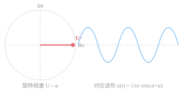
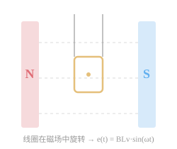
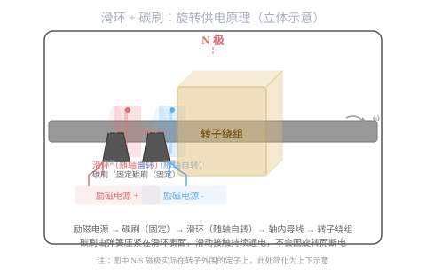

# 第零层：数学工具

> 电力系统的语言是数学。没有这层工具，后面所有分析都只能停留在"感觉"层面。
>
> 你的目标不是"学会数学证明"，而是**能熟练运用这些工具分析电气量**。



---

## 目录

- [0.1 相量与复数](#01-相量与复数)
  - [为什么是正弦波](#为什么是正弦波)
  - [为什么 3000 转/分 = 50Hz](#为什么-3000-转分--50hz)
  - [详细推导：为什么相量能把微分方程变成代数方程](#详细推导为什么相量能把微分方程变成代数方程)
- [0.2 对称分量法数学基础](#02-对称分量法数学基础)
- [0.3 标幺制](#03-标幺制)
- [综合代码项目](#综合代码项目)
- [本层检验标准](#本层检验标准)

---

## 0.1 相量与复数

### 为什么需要相量

交流电力系统中，电压和电流都是正弦波。

### 为什么是正弦波

> 不是"因为教材选了正弦波"，而是发电机的物理结构决定了它只能发出正弦波。

#### 根本原因：发电机物理结构

发电机本质上是**线圈在磁场里旋转**：



```
              N
              |
              ↓ 磁场方向 B
    ┌─────────┴─────────┐
    │         ↑         │
    │      ┌──┴──┐      │
    │      │ 线圈 │←── 以角速度 ω 匀速旋转
    │      └──┬──┘      │
    │         ↓         │
    └───────────────────┘
              |
              S
```

线圈在磁场中切割磁力线，感应出电动势。关键在于：

**线圈平面的法线与磁场方向的夹角 θ = ωt，随时间连续变化。**

但 e(t) = BLv·sin(ωt) 这个公式具体是怎么来的？一步步拆解。

#### 第一步：底层物理定律——洛伦兹力

运动的电荷在磁场中会受到一个力，方向由叉乘决定：

```
F = q · v × B
```

- q：电荷量
- v：电荷运动速度（矢量）
- B：磁感应强度（矢量）
- ×：叉乘，方向用右手定则判断

> 翻译成人话：一根导线在磁场里移动，导线内部的电子会受到一个力被推向一端，于是导线两端出现电压。

#### 第二步：化简——直导线垂直切割磁场

一根长度 L 的直导线，在均匀磁场 B 中以速度 v 运动，v ⊥ B：

```
        导线（长度 L）
    ────────────────→ v（运动方向）
    ↑  ×  ×  ×  ×
    │  ×  ×  B  ×        B 磁场方向垂直纸面向里（× 符号）
    │  ×  ×  ×  ×
    └──→ F = q·v·B（电子受力方向）
```

导线里的每个电子受的力：

```
F = q·v·B （v ⊥ B 时取最大值）
```

这个力把电子推到导线一端，等效于导线内部出现了一个电场：

```
E = F / q = v·B
```

所以感应电动势 = 电场强度 × 导线长度：

```
e = E · L = BLv
```

**这是最简单的情况：导线垂直于磁场运动。**

#### 第三步：加入角度——导线不垂直于磁场

实际中，导线运动方向不一定正好垂直于磁场。设运动方向与磁场方向的夹角为 θ：

```
        ────→ v（导线运动方向）
        ↑
        │ θ
        │
        ↓ B（磁场方向，向下）
```

只有**垂直于磁场方向**的速度分量才切割磁力线：

```
v_perpendicular = v · sin(θ)
```

平行于磁场的分量 v·cos(θ) 不切割磁力线，不产生电动势。

代入 e = BLv：

```
e = B · L · v_perpendicular = BLv · sin(θ)
```

**这就是完整的公式。**

#### 第四步：应用到发电机——线圈在磁场中旋转

发电机里，线圈匀速旋转：

```
         ω（角速度）
         ↷  旋转方向
       ┌──┴──┐
       │线圈  │← 线圈以 ω rad/s 旋转
       └──┬──┘
    ──────┴──────→ 线圈的切割速度方向（线速度方向）
    ↑
    │ B 磁场方向（向上）
```

关键几何关系：

- 线圈的**线速度** v = ω · r（r 是线圈半径，恒定）
- 线圈平面法线与 B 的初始夹角在 t 时刻为 θ = ωt（随时间线性增长）
- 有效的切割速度是 v 在垂直于 B 方向的分量：v_eff = v · sin(θ) = v · sin(ωt)

代入：

```
e(t) = B · L · v · sin(ωt)
     = BLv · sin(ωt)
```

- B：磁感应强度，恒定
- L：线圈有效长度，恒定
- v：线速度，恒定

所以 e(t) 唯一的变化来自 sin(ωt)——**旋转运动天然产生了正弦波。**

**线圈每转一圈，θ 从 0 到 2π，sin(ωt) 完成一个完整周期。这就是交流电 50Hz 的物理来源：**

```
转速 3000 转/分 = 50 转/秒 → 频率 f = 50Hz → ω = 2πf = 314 rad/s
```

### 为什么 3000 转/分 = 50Hz

> 这个关系由公式 n = 60f/p 决定。下面拆开推导。

#### 从 sin(θ) 的完整周期看频率

前面已经推导出 e(t) = BLv·sin(ωt)，其中 θ = ωt。

- 转子的**角速度** ω 单位是 rad/s
- 转子转一圈，θ 变化 2π（弧度），sin(θ) 完成一个完整周期
- 转子每秒转 n_rps 圈（rps = 转/秒），每秒完成 n_rps 个正弦波周期

**所以频率 f（每秒正弦波周期数）= 转子每秒转的圈数 n_rps：**

```
f = n_rps
```

#### 引入磁极对数 p

上面假设转子上只有**一对磁极（1 个 N + 1 个 S，p = 1）**。

但如果转子上有两对磁极（p = 2）：

```
        N            ← 第一个 N
    ┌───┴───┐
   S│       │S       ← 两侧是 S
    │ 转子  │
   N│       │N       ← 两侧是 N
    └───┬───┘
        S            ← 最后一个 S
```

从线圈看过去，磁场方向不是均匀的，而是绕一圈看到 **N → S → N → S 交替**：

| 线圈转过 | 磁场极性 | e(t) 变化 |
|---------|---------|----------|
| 第一个 N → S | 磁场翻转一次 | 完成半个正弦波（+max → 0 → -max） |
| 第二个 N → S | 磁场再翻转一次 | 完成另外半个正弦波（-max → 0 → +max） |

> **经过一对 N → S（一次磁场翻转）= 产生一个完整正弦波。**

所以：

```
p = 1：转子转 1 圈 → 经过 1 对磁极 → 1 个正弦波
p = 2：转子转 1 圈 → 经过 2 对磁极 → 2 个正弦波
p = p：转子转 1 圈 → 经过 p 对磁极 → p 个正弦波
```

#### 归纳成公式

转子每秒转 n_rps 圈：

```
每秒正弦波个数 = n_rps（转/秒） × p（个/转）

而这个值就是频率 f（Hz）：

f = n_rps × p
```

#### 单位转换：rpm → rps

工程上转速习惯用**转/分（rpm）**而不是转/秒（rps）：

```
n_rpm = n_rps × 60    （每分钟 60 秒）

所以：
f = (n_rpm / 60) × p
```

移项得：

```
n_rpm = 60 × f / p
```

**这里的 60 就是「分钟 → 秒」的单位换算系数。**

代入电网频率 f = 50Hz：

| p（磁极对数） | n（rpm） | 典型机组 |
|-------------|---------|---------|
| 1 | 60×50/1 = 3000 | 火电汽轮机 |
| 2 | 60×50/2 = 1500 | 水电站中速机组 |
| 3 | 60×50/3 = 1000 | 风机/低速水电 |
| 4 | 60×50/4 = 750 | 瀑布沟等大型水电机组 |

#### 一句话总结

> 磁极对数 p 越多，转子转一圈产出的正弦波越多，维持 50Hz 需要的转速就越低。公式 n = 60f/p 的 60 只是单位换算：把转速从"转/秒"换算成"转/分"。

#### 回到 ω

现在你应该能完整理解 ω 了：

```
ω = 2πf = 2π × 50 = 314 rad/s

它表示：虽然你在公式里看到的是 sin(ωt)，
实际上 ω 背后是转子以 3000 转/分（p=1）的物理旋转。
```

#### 与你已有知识的连接：CT 也是这个原理

你在 FTU 里处理 CT 采样，CT 的工作原理**根上是同一条物理定律——法拉第电磁感应定律**：

| 形式 | 公式 | 场景 |
|------|------|------|
| 动生电动势（切割） | e = BLv·sinθ | **发电机** — 导线动，磁场不动 |
| 变压器电动势（互感） | e = N·dΦ/dt | **CT/PT** — 磁场变，线圈不动 |

不同的是表现形式：

- **发电机：** 导线切割磁力线，产生电动势
- **CT：** 一次电流产生变化的磁场，二次线圈感应出电动势

> 一个是导线动磁场不动，一个是磁场动导线不动，本质都是电磁感应。

#### 总结

```
洛伦兹力 F = q(v × B)                 ← 最根本的物理定律
         ↓
直导线切割磁场: e = BLv（v⊥B）         ← 特殊情况的简化
         ↓
加入角度: e = BLv·sin(θ)              ← 完整公式
         ↓
线圈旋转: θ = ωt → e(t) = BLv·sin(ωt)  ← 发电机产生正弦波
```

> 因为 θ = ωt 是**连续的旋转角度**，sin(ωt) 是天然出现的。发电机不需要任何额外电路就能产生正弦波——它是物理结构和旋转运动决定的。

#### 一个自然的问题：转子通电旋转，线不会拧断吗？

> 转子上的励磁绕组需要通电才能产生磁场，但转子以 3000 转/分旋转，电线直接连出去一拧就断。
>
> 解决方案：**滑环 + 碳刷**。

下面这个动画演示滑环和碳刷如何解决"旋转部件的供电问题"：



**原理：**

**原理：**

```
励磁柜（直流电源）
    │
    ├──（导线）──→ 碳刷（固定不动）── 摩擦接触 ──→ 滑环（跟着转）
    │                                                    │
    │                                                    │ 轴内导线
    │                                                    ↓
    └──（导线）──→ 碳刷（固定不动）── 摩擦接触 ──→ 滑环（跟着转）
                                                         │
                                                         │ 轴内导线
                                                         ↓
                                                   转子励磁绕组（产生磁场）
```

**为什么不会磨坏：**
- 碳刷材质是石墨，有自润滑性
- 有弹簧顶着自动补偿磨损
- 定期巡检更换（几百~几千小时换一次）
- 大型现代机组用**无刷励磁**（旋转整流器），连碳刷都省了

**效率层面：**

发电机线圈连续旋转，感应电动势是平滑变化的。要发出方波，意味着感应电动势要"瞬间从 0 跳到最大值"，但线圈切割磁力线是**连续过程**，物理上不可能跳变。

```
方波：▁▁▁▁▁▁▁│▔▔▔▔▔▔▔▔│▁▁▁▁▁▁▁│▔▔▔▔▔▔▔▔
         这种跳变对旋转发电机物理上不可实现

正弦波：～\_/‾‾\_/‾‾\_/‾‾  （连续平滑）
```

**系统层面：**

整个输配电系统围绕正弦波优化设计：

| 设备 | 为什么只爱正弦波 |
|------|----------------|
| 变压器 | 靠正弦磁通工作，非正弦波（=谐波）导致铁芯额外发热 |
| 线路 | 非正弦波的陡变沿产生高 dV/dt，增加绝缘应力和电磁辐射 |
| 开关 | 正弦波过零点自然灭弧，非正弦波难以开断 |

**数学层面：**

任何非正弦周期波都可以分解为基波 + 谐波（傅里叶级数）：

```
方波 = sin(ωt) + (1/3)·sin(3ωt) + (1/5)·sin(5ωt) + ...  无数的正弦波叠加
```

谐波越多，损耗越大，设备越热。所以电网从源头（发电机）就选择输出正弦波。

#### 一个来自你工作现场的印证

你在 FTU 里采到的电压电流并不是完美正弦波——这就是谐波畸变：

```
u(t) = U1·sin(ωt) + U3·sin(3ωt) + U5·sin(5ωt) + ...
```

产生原因：非线性负载（整流器、变频器、LED 驱动）"污染"了波形。

> 但你看到的畸变，恰恰证明**原信号应该是正弦波**——畸变是以"偏离正弦"来定义的。如果你 FTU 里做谐波分析，就是在计算这些偏离分量。

#### 总结

```
发电机线圈旋转 → 物理上产生正弦波（根因）
       ↓
变压器/线路/开关围绕正弦波优化设计（系统约束）
       ↓
电网统一采用正弦波（行业事实）
       ↓
你 FTU 里所有分析都建立在正弦波假设上（工作现实）
```

### 回到相量

交流电力系统中，电压和电流都是正弦波：

```
u(t) = Um · sin(ωt + φ)
```

如果直接用正弦函数计算功率、阻抗，需要求解微分方程，非常繁琐。

**相量的核心思想：** 用复数来表示正弦量，把微分方程变成代数方程。

### 从正弦量到相量

```
u(t) = Um · sin(ωt + φ)
    ↓  用欧拉公式 e^jθ = cosθ + j·sinθ
u(t) = Im[Um · e^(j(ωt+φ))]
    ↓  去掉时间因子 e^(jωt)，只保留幅值和相位信息
U·   = U∠φ     （U 是有效值 = Um/√2）
```

**这就是相量：** 一个复常数，模 = 有效值，幅角 = 初相角。

### 相量的两种表示

| 形式 | 表达式 | 适用场景 |
|------|--------|---------|
| 极坐标 | U∠φ | 直观看出幅值和相位，潮流计算 |
| 直角坐标 | a + jb | 加减运算方便，短路计算 |

**互相转换：**

```
a = U·cosφ        U = √(a² + b²)
b = U·sinφ        φ = arctan(b/a)   // 注意象限
```

### 相量运算规则

**加减法：** 直角坐标形式，实部虚部分别加减

```
U1· + U2· = (a1 + a2) + j(b1 + b2)
```

**乘除法：** 极坐标形式，模相乘除，幅角相加减

```
U1· × U2· = U1·U2 ∠(φ1 + φ2)
U1· ÷ U2· = U1/U2 ∠(φ1 - φ2)
```

**旋转因子 a = e^(j120°)：**

```
a  = cos120° + j·sin120° = -1/2 + j·√3/2
a² = cos240° + j·sin240° = -1/2 - j·√3/2
a³ = 1

1 + a + a² = 0
```

这个 a 是对称分量法的核心——记住它。

### 详细推导：为什么相量能把微分方程变成代数方程

> 这是整个相量理论最关键的一步。理解了它，你就理解了相量存在的全部意义。

#### 场景：RLC 串联电路

一个电阻 R、电感 L、电容 C 串联，两端加正弦电压 u(t)：

```
    R        L        C
───/\/\/\───○○○───|(───
+                         |
u(t)                      |
-                         |
──────────────────────────
```

**时域内：必须解微分方程**

根据基尔霍夫电压定律（KVL）：沿回路一圈，电压降之和为零。

电阻上的电压：u_R(t) = R·i(t)
电感上的电压：u_L(t) = L·di(t)/dt    （电流变化率）
电容上的电压：u_C(t) = (1/C)·∫i(t)dt  （电流的积分）

所以：

```
u(t) = R·i(t) + L·di(t)/dt + (1/C)·∫i(t)dt
```

这是**微分-积分方程**。每换一个电路结构就要重新解，非常麻烦。

#### 关键观察

如果 u(t) 和 i(t) 都是**同频率的正弦波**，那么：

```
对正弦波求导  =  幅值乘 ω，相位超前 90°
对正弦波积分  =  幅值除以 ω，相位滞后 90°
```

数学上：

```
u(t) = U·sin(ωt)    （暂时忽略初相）
du/dt = U·ω·sin(ωt + 90°)
∫u dt = -(U/ω)·sin(ωt - 90°)
```

**求导和积分，在正弦波上只是幅值和相位的变化。**

#### 相域下的对应

在复数世界里：

- 乘以 j = 幅值不变，旋转 +90°
- 除以 j = 乘以 -j = 幅值不变，旋转 -90°

```
j = 1∠90°    → 乘以 j 就是 幅值不变，相位超前 90°
-j = 1∠-90°  → 除以 j 就是 幅值不变，相位滞后 90°
```

**所以得到了最关键的对应关系：**

| 时域对正弦量的操作 | 相域对应的运算 |
|-----------------|--------------|
| d/dt（求导） | × jω |
| ∫dt（积分） | ÷ jω = × (-j/ω) |

> 求导和积分在时域里是微分和积分运算，在相域里只是**乘一个复数系数**。

#### 回到 RLC 电路，这次用相量

时域方程：

```
u(t) = R·i(t) + L·di(t)/dt + (1/C)·∫i(t)dt
```

**逐项转换成相域：**

- u(t) → U·（电压相量）
- i(t) → I·（电流相量）
- R·i(t) → R·I·（电阻不变，常数倍还是常数倍）
- L·di(t)/dt → L × (jω·I·) = jωL·I·（求导 → × jω）
- (1/C)·∫i(t)dt → (1/C) × (I·/(jω)) = I·/(jωC)（积分 → ÷ jω）

全部代入：

```
U· = R·I· + jωL·I· + I·/(jωC)
   = (R + jωL + 1/(jωC)) · I·
   = [R + j(ωL - 1/(ωC))] · I·
   = Z · I·
```

**其中 Z = R + j(ωL - 1/(ωC)) 就是复阻抗。**

#### 结果：一个微分方程变成了一个代数方程

```
时域：u(t) = R·i(t) + L·di(t)/dt + (1/C)·∫i(t)dt      ← 微分方程
相域：U· = Z · I·                                       ← 代数方程（复数欧姆定律）
```

然后想求电流？直接除法：

```
I· = U· / Z
```

想求某个元件的电压？直接乘法：

```
U_R· = R·I·
U_L· = jωL·I·
U_C· = I·/(jωC)
```

**全部是复数的乘除法，没有微分，没有积分。**

#### 总结：相量到底做了什么

| | 时域（正弦函数） | 相域（复数） |
|---|---|---|
| 电阻 | R | R |
| 电感 | L·di/dt | jωL |
| 电容 | (1/C)·∫dt | 1/(jωC) |
| 电路方程 | 微分方程 | 代数方程(复数欧姆定律) |
| 求解难度 | 繁琐 | 简单 |

**相量的本质：利用复数运算规则，把对正弦量的微积分运算变成了乘法，从而把微分方程变成了代数方程。**

#### 与你日常工作的关联

你在 FTU 里算功率，就是在做相量运算：

```
P = U·I·cosφ
Q = U·I·sinφ
```

转化成复数形式就是：

```
S· = U· × I·*      （I·* 是电流相量的共轭复数）
P = Re(S·)          // 有功功率 = 复数功率的实部
Q = Im(S·)          // 无功功率 = 复数功率的虚部
```

**你每天在代码里算功率，就是在用相量理论。** 只是你之前不知道背后的数学逻辑。

```
// FTU 伪代码——你很可能写过类似的
typedef struct {
    float real;  // 实部
    float imag;  // 虚部
} complex_t;

complex_t phasor_power(complex_t U, complex_t I) {
    // S = U × I*   (I的共轭)
    complex_t S;
    S.real = U.real * I.real + U.imag * I.imag;
    S.imag = U.imag * I.real - U.real * I.imag;
    return S;   // real = P, imag = Q
}
```

**你工作中每天用，现在知道为什么了。**

### Feynman 检验 1

> "相量就是把交流电的幅值和相位打包成一个复数，这样分析电路时就不用解微分方程了。"

试着把这句话展开成两三句话，写在下面。写出来就算过。

### 练习题

1. 已知 u(t) = 311·sin(100πt + 30°)，写出其相量形式（有效值相量）。
2. 两个相量：U1· = 220∠0°，U2· = 220∠-120°，求 U1· + U2· 的极坐标形式。
3. Z = 4 + j3Ω，I· = 50∠-30°A，求电压相量 U·。

题做完才能往下走。

---

## 0.2 对称分量法数学基础

### 为什么要对称分量法

电网正常运行时三相对称：

```
Ua + Ub + Uc = 0
Ia + Ib + Ic = 0
```

但发生故障时，三相不再对称。对称分量法就是把**不对称的三相量分解为三组对称的相量**。

### 数学定义

```
[I0]      [1  1    1 ] [Ia]
[I1] = 1/3[1  a   a²] [Ib]
[I2]      [1  a²  a ] [Ic]
```

其中 a = e^(j120°) = -1/2 + j·√3/2

**三组对称分量：**

| 分量 | 物理含义 | 三相特征 |
|------|---------|---------|
| 正序 (I1) | 正常能量传输 | A 超前 B 120°，B 超前 C 120° |
| 负序 (I2) | 不对称故障 | A 滞后 B 120°（反向旋转） |
| 零序 (I0) | 接地故障 | 三相幅值相位完全相同 |

### 逆变换

```
Ia = I1 + I2 + I0
Ib = a²·I1 + a·I2 + I0
Ic = a·I1 + a²·I2 + I0
```

### 关键性质

**1. 三相对称时零序为零**

如果 Ia + Ib + Ic = 0，则 I0 = 0。正常电网没有零序分量。

**2. 零序的出现 = 不对称或接地**

这也是为什么零序保护能检测接地故障的数学根源。

**3. 负序的出现 = 不对称故障**

如两相短路、单相断线。

### Feynman 检验 2

> "不平衡的三相可以拆成三组对称分量：正序像正常的旋转磁场，负序像反向旋转的磁场，零序像三个相等的分量同方向振动。正序+N＝负序+零序+原有不对称。"

试着用自己的话说出来。

### 练习题

已知三相电流（有效值相量）：

```
Ia = 100∠0°
Ib = 50∠-150°
Ic = 30∠90°
```

求：

1. 零序电流 I0（复数形式）
2. 正序电流 I1（复数形式）
3. 判断这组电流中是否存在接地故障分量

提示：用公式算 I0 = (Ia + Ib + Ic) / 3

---

## 0.3 标幺制

### 为什么用标幺值

电网中有多个电压等级：

```
500kV → 220kV → 110kV → 10kV → 380V
```

每个电压等级下，同样一个阻抗的欧姆值在不同的基准电压下代表不同的"电气意义"。直接用有名值计算非常麻烦。

**标幺制的思想：** 设定基准值，把实际值转换成相对值。

### 定义

```
标幺值 = 实际值 / 基准值
```

用 p.u.（per unit）表示。

### 基准值的选择

电力系统中通常先选两个基准值，其余两个由公式导出：

**通常：**

- 基准功率 S_base = 100MVA（约定俗成，全国统一）
- 基准电压 U_base = 该电压等级的平均额定电压（如 10.5kV, 115kV, 230kV, 525kV）

**导出：**

```
Z_base = U_base² / S_base
I_base = S_base / (√3 · U_base)
```

### 不同电压等级间的换算

标幺值的最大优势：**标幺值可以直接跨电压等级运算。**

例如，一段 10kV 线路的阻抗标幺值为 0.05 p.u.，折算到 110kV 侧时：

- 有名值变了（因为基准阻抗不同），但标幺值不变（同样一段线路）

这就是为什么电力系统所有人都在用标幺值。

### 典型计算示例

```
U_base = 110kV（110kV 电压等级）
S_base = 100MVA

Z_base = (110²) / 100 = 121Ω

一条线路实际阻抗 Z = 12.1Ω
标幺值 Z(p.u.) = 12.1 / 121 = 0.1 p.u.
```

### Feynman 检验 3

> "标幺值就是把实际值除以一个基准值，变成相对值。就像说'这根线阻抗是标准值的 0.1 倍'。好处是不同电压等级的电气量可以直接比较和运算。"

### 练习题

已知某 10kV 配电网线路：

- S_base = 100MVA
- U_base = 10.5kV
- 线路实际阻抗 Z = 0.5 + j0.8Ω
- 线路末端负载 S = 5 + j3MVA

求：

1. 该电压等级的 I_base 和 Z_base
2. 线路阻抗的标幺值
3. 负载功率的标幺值
4. 如果该线路短路电流有名值为 5kA，标幺值是多少？

---

## 综合代码项目

> 把以上三个工具实现成代码，才算真正落地。

### 项目要求

用 Python 或 C 实现以下功能：

**模块一：复数相量运算库**

```
- to_polar(real, imag) → (mag, angle)    直角坐标转极坐标
- to_rect(mag, angle) → (real, imag)     极坐标转直角坐标
- phasor_add(p1, p2) → p3                相量加法（直角坐标）
- phasor_sub(p1, p2) → p3                相量减法
- phasor_mul(p1, p2) → p3                相量乘法（极坐标）
- phasor_div(p1, p2) → p3                相量除法
- print_phasor(p)                         格式化输出 U∠φ°
```

**模块二：对称分量法计算**

```
- symmetrical_components(Ia, Ib, Ic) → (I0, I1, I2)
- inverse_symmetrical(I0, I1, I2) → (Ia, Ib, Ic)
- fault_type_detect(Ia, Ib, Ic) → "AG" / "BC" / "ABC" / "normal"
    // 根据零序/负序分量初步判断故障类型
```

**模块三：标幺值换算**

```
- calc_base_impedance(U_base, S_base) → Z_base
- calc_base_current(U_base, S_base) → I_base
- to_per_unit(actual_value, base_value) → pu_value
- from_per_unit(pu_value, base_value) → actual_value
```

### 验收方式

用练习题中的数据作为输入，运行你的代码，输出结果与手工计算结果对比。

### 项目扩展（可选）

把以上三个模块组合成一个命令行工具：

```
power-tool phasor --rect 3 4 --to-polar
power-tool sym-comp --ia 100∠0 --ib 50∠-150 --ic 30∠90
power-tool per-unit --actual 0.5+j0.8 --base-u 10.5 --base-s 100
```

---

## 本层检验标准

完成本层后，你应该能：

1. ✅ 在纸上写出任意正弦量的相量形式
2. ✅ 用复数运算计算两个相量的加减乘除
3. ✅ 用对称分量法从三相量中分解出零序分量
4. ✅ 计算任意电压等级下的基准值和标幺值
5. ✅ 写出相量运算库的核心函数

完成以上 5 条之后，进入第 1 层（物理本质）。

---

## 参考答案

### 0.1 练习题

1. Um = 311V，U = 311/√2 ≈ 220V，φ = 30° → U· = 220∠30°V

2. ```
   U1 + U2 = 220∠0° + 220∠-120°
            = 220 + 220(-1/2 - j·√3/2)
            = 220 - 110 - j·190.5
            = 110 - j·190.5
            = 220∠-60°V
   ```

3. Z = 4 + j3 = 5∠36.87°Ω
   U· = I· × Z = 50∠-30° × 5∠36.87° = 250∠6.87°V

### 0.2 练习题

```
I0 = (100∠0° + 50∠-150° + 30∠90°) / 3

100∠0° = 100 + j0
50∠-150° = 50(-√3/2 - j·1/2) = -43.3 - j25
30∠90° = 0 + j30

I0 = (100 - 43.3 + 0) + j(0 - 25 + 30) / 3
   = (56.7 + j5) / 3
   = 18.9 + j1.67
   = 18.97∠5.05°A

I0 ≠ 0，存在接地分量，初步判断存在接地故障。
```

### 0.3 练习题

1. ```
   I_base = S_base / (√3 · U_base) = 100 / (1.732 · 10.5) = 5.5kA
   Z_base = U_base² / S_base = 10.5² / 100 = 1.1025Ω
   ```

2. ```
   Z(p.u.) = (0.5 + j0.8) / 1.1025 = 0.453 + j0.726 p.u.
   ```

3. ```
   S(p.u.) = (5 + j3) / 100 = 0.05 + j0.03 p.u.
   ```

4. ```
   I(p.u.) = 5 / 5.5 = 0.909 p.u.
   ```
