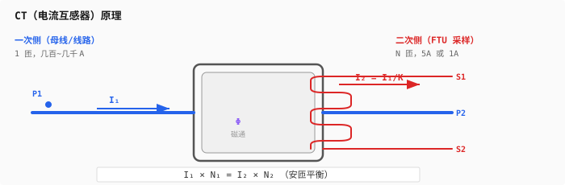
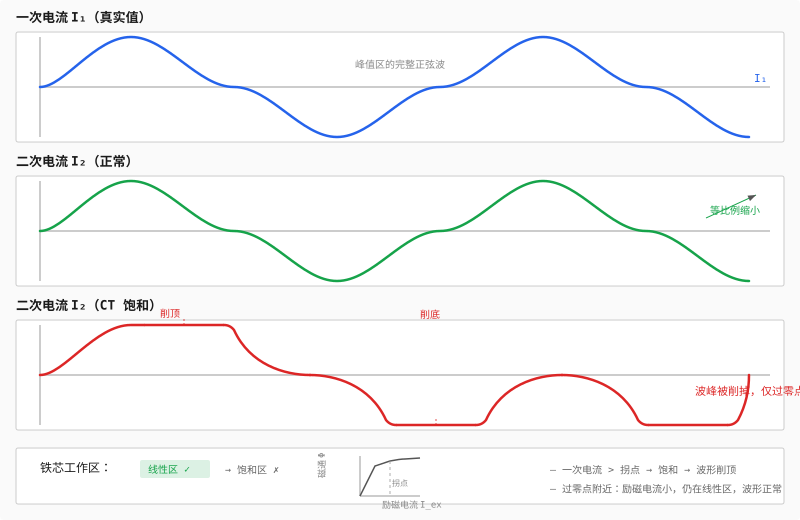
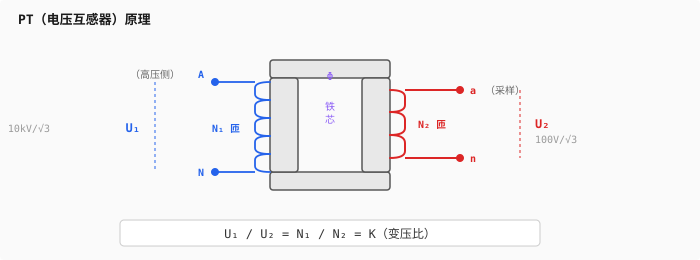
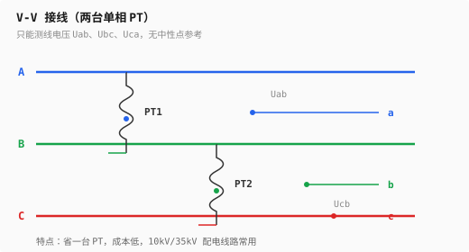
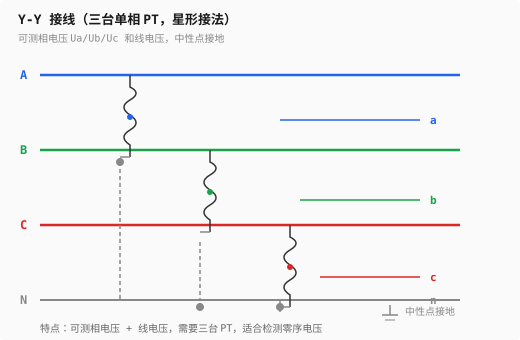
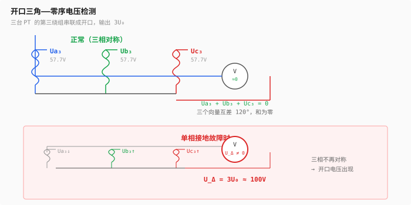
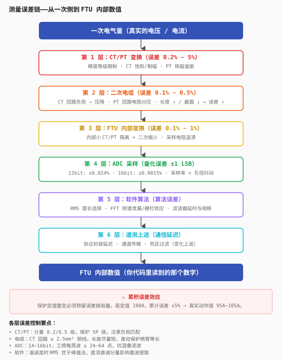

# 第二层：测量系统

> 这是从物理世界到数字世界的桥梁。作为 FTU 开发者，这一层是你的"牙齿"——你每天读写 CT/PT 数据，真正理解它们背后的原理，才能写出正确的保护逻辑。
>
> 第1层告诉你"电是什么"。这一层告诉你**电是怎么被看见的**。

---

## 目录

- [2.1 CT（电流互感器）](#21-ct电流互感器)
  - [基本原理](#基本原理)
  - [为什么二次侧绝对不能开路](#为什么二次侧绝对不能开路)
  - [CT 极性](#ct-极性)
  - [CT 饱和](#ct-饱和)
  - [精度等级与 10% 误差曲线](#精度等级与-10-误差曲线)
- [2.2 PT（电压互感器）](#22-pt电压互感器)
  - [基本原理](#基本原理-1)
  - [为什么二次侧不能短路](#为什么二次侧不能短路)
  - [接线方式：V-V 与 Y-Y](#接线方式v-v-与-y-y)
  - [开口三角——零序电压的检测器](#开口三角零序电压的检测器)
  - [PT 断线——你在现场一定遇到过](#pt-断线你在现场一定遇到过)
- [2.3 接线方式与功率计算](#23-接线方式与功率计算)
  - [三相三线（两瓦特计法）](#三相三线两瓦特计法)
  - [三相四线（三瓦特计法）](#三相四线三瓦特计法)
  - [FTU 代码中的处理](#ftu-代码中的处理)
- [2.4 测量误差链](#24-测量误差链)
  - [从一次侧到 FTU 内部数值的全路径](#从一次侧到-ftu-内部数值的全路径)
  - [每级误差的来源与控制](#每级误差的来源与控制)
- [2.5 电量计算与参数整定](#25-电量计算与参数整定)
  - [有功功率的三种计算方法](#有功功率的三种计算方法)
  - [无功功率的三种计算方法](#无功功率的三种计算方法)
  - [电压与电流的有效值计算](#电压与电流的有效值计算)
  - [功率因数的计算与符号](#功率因数的计算与符号)
  - [CT/PT 变比整定](#ctpt-变比整定)
  - [零漂与增益校准](#零漂与增益校准)
  - [角差补偿](#角差补偿)
- [Feynman 综合检验](#feynman-综合检验)
- [练习题](#练习题)
- [代码化项目](#代码化项目)

---

## 2.1 CT（电流互感器）

### 基本原理

CT 本质是一台变压器——把一次侧的大电流按比例缩小为二次侧的小电流。



核心关系——安匝平衡：

```
I₁ × N₁ = I₂ × N₂         一次安匝 = 二次安匝

I₂ = I₁ × (N₁ / N₂) = I₁ / K       K = 变比

例如：CT 变比 600/5，K = 120
一次侧流过 600A → 二次侧输出 5A
```

二次侧额定电流通常为 **5A** 或 **1A**（保护用多用 5A，长距离电缆引线用 1A 减少线损）。

### 为什么二次侧绝对不能开路

这是 CT 最致命的安全规则。原因在安匝平衡：

```
正常工作时：
  I₁·N₁ (一次安匝) ≈ I₂·N₂ (二次安匝)
  一次安匝和二次安匝互相抵消，铁芯磁通很小

二次侧开路时：
  I₂ = 0 → I₂·N₂ = 0
  但 I₁·N₁ 不变！
  全部一次安匝变成励磁安匝 → 铁芯深度饱和
```

铁芯深度饱和会产生两个后果：

**后果一：二次侧感应出危险高压**

```
铁芯磁通以 50Hz 过零点 → 磁通变化率 dΦ/dt 极大
→ 二次绕组感应出几千伏尖峰电压 → 危及人身和设备
```

**后果二：铁芯发热烧毁**

```
深度饱和 → 磁滞损耗和涡流损耗暴增 → 铁芯过热 → 绝缘损坏
```

> 现场铁律：**CT 二次侧运行中绝对不能开路。** 检修时必须先短接二次端子再拆线。FTU 的 CT 输入回路设计中，通常有开路保护二极管或压敏电阻作为最后防线。

### CT 极性

CT 有极性标记——一次侧 P1（进）、P2（出），二次侧 S1、S2。极性定义了**二次电流相对于一次电流的方向**。

```
减极性（标准接法）：
  P1 → P2 方向的一次电流
  对应 S1 → S2 方向的二次电流
  （S1 和 P1 同极性端）
```

为什么极性重要？因为你 FTU 里的**方向保护靠极性判断故障方向**：

```
正常负荷电流方向：母线 → 线路（正向）
故障电流方向（线路侧故障）：仍然是母线 → 线路（正向）
故障电流方向（母线侧故障）：线路 → 母线（反向）

如果 CT 极性接反 → 正常负荷被判为反向 → 方向保护完全错乱
```

你在保护逻辑里写的方向判据——用电压和电流的夹角判断正向/反向——前提是 CT 极性正确。

### CT 饱和

这是 FTU 开发者最需要深刻理解的 CT 特性。饱和直接影响保护能否正确动作。

**正常情况：** 铁芯工作在磁化曲线的线性区，二次电流 = 一次电流 / 变比，波形完美。

**饱和时：** 一次电流太大（或含直流分量），铁芯进入磁化曲线的饱和区。此时同样的励磁电流增量只产生很小的磁通增量 → 二次侧感应不出足够的电流 → **二次电流波形被"削顶"，严重畸变**。



> 一次电流 I₁：完美正弦波
> 二次电流 I₂（正常）：等比例缩小，完全复刻一次波形
> 二次电流 I₂（饱和）：波峰被削掉，仅在过零点附近有正常输出

**饱和对 FTU 保护的影响：**

```
饱和时 → 二次电流有效值远小于真实值
      → FTU 算出的电流偏小
      → 可能达不到过流定值
      → 保护拒动！
```

**饱和特征（可以用来在代码中检测）：**

- 波形在过零点附近正常，峰值附近被削平
- 二次电流含有大量奇次谐波（3 次、5 次）
- 饱和发生后几个毫秒内波形是正常的（因为铁芯从剩磁点出发需要时间）

### 精度等级与 10% 误差曲线

CT 不是理想的——它有误差。精度等级告诉你它在什么条件下误差有多大。

**计量/测量用 CT：**

| 精度等级 | 含义 | 用途 |
|---------|------|------|
| 0.2 | 额定电流下误差 ≤ 0.2% | 关口计量 |
| 0.5 | 额定电流下误差 ≤ 0.5% | 普通计量/测量 |
| 1.0 | 额定电流下误差 ≤ 1.0% | 一般测量 |

**保护用 CT：**

```
5P10  →  在 10 倍额定电流下，复合误差 ≤ 5%
10P20 →  在 20 倍额定电流下，复合误差 ≤ 10%

P  = Protection（保护用）
数字 = 准确限值系数（ALF）= 额定电流的倍数
```

为什么保护用 CT 不追求高精度（5% 够用），但追求大倍数（10 倍、20 倍）？因为**保护只需要知道"有没有超过定值"**，不需要精确到 0.2%。但它必须在短路电流（可能十几倍额定值）下仍然不饱和、有输出。

**10% 误差曲线：**

给定一个 CT，它的误差和**二次负载（负担）**直接相关。二次接的线太长、阻抗太大 → CT 需要更大的励磁电压 → 更容易饱和。

```
10% 误差曲线 = 一条曲线，横轴是二次负载阻抗，纵轴是允许的一次电流倍数

在曲线下方的区域：CT 误差 < 10%
在曲线上方的区域：CT 误差 > 10%（不能接受）
```

工程含义：你 FTU 的 CT 输入回路阻抗 + 引线阻抗，不能超过 CT 的允许负担。

---

## 2.2 PT（电压互感器）

### 基本原理

PT 和 CT 一样是变压器，但它是**电压源**——把一次侧高电压按比例缩小为二次侧低电压。



### 为什么二次侧不能短路

这是 PT 和 CT 最核心的区别——两者对二次侧"不该发生的事"**刚好相反**。

```
CT：二次侧绝对不能开路（会感应危险高压）
PT：二次侧绝对不能短路（会产生危险大电流）
```

原因：PT 一次侧是电压源（并联在线路上），二次侧感应出的也是电压源。短路 → U₂ 直接加在极小阻抗上 → I₂ 暴增 → 绕组烧毁。

```
CT 是电流源型设备 → 怕开路
PT 是电压源型设备 → 怕短路
```

工程上，PT 二次回路一定有**熔丝或空开**——短路时熔丝熔断，保护 PT 本体。

### 接线方式：V-V 与 Y-Y

**V-V 接线（两台单相 PT，开口三角形接法）：**



特点：
- 只能测量**线电压** Uab、Ubc、Uca（没有中性点参考）
- 省一台 PT，成本低
- 常见于 10kV、35kV 配电线路

**Y-Y 接线（三台单相 PT，星形接法）：**



特点：
- 可以测量**相电压** Ua、Ub、Uc 和**线电压**
- 需要三台 PT
- 中性点可以接地，适合需要检测零序电压的场景

### 开口三角——零序电压的检测器

Y-Y 接线的 PT 通常还有一个**第三绕组**（tertiary winding），三个第三绕组串联成开口三角：



**正常（三相对称）时：**

```
Ua₃ + Ub₃ + Uc₃ = 0 → U_Δ ≈ 0
三个第三绕组电压互差 120°，向量和为零
```

**单相接地故障时：**

```
接地相电压降低 → 该相第三绕组电压也降
非接地相电压升高 → 第三绕组电压也升
三相不再对称 → U_Δ ≠ 0 → 输出 3U₀（零序电压的三次谐波叠加值）
```

> 开口三角输出电压 `U_Δ = 3U₀`。你的 FTU 检测到开口三角有输出电压 → 系统中存在零序电压 → 发生了接地故障。

二次侧额定值：正常时开口电压 0V，接地时输出 100V（对应 3U₀ = 100V）。

### PT 断线——你在现场一定遇到过

PT 一次侧或二次侧熔丝熔断（一相或两相），导致 FTU 采到的电压异常。

**现象：**

```
A 相熔丝断 → FTU 读到 Ua ≈ 0（或大幅降低）
            → 功率计算全错
            → 方向保护可能误判！
```

**为什么可怕：**

方向保护靠电压和电流的夹角判断故障方向。电压少了一相或完全不对 → 夹角算出来是错的 → 正常运行可能被判为正向故障 → **保护误动**。

**FTU 代码中的 PT 断线判据：**

```
判据一：出现负序电压，但没有负序电流
        → 如果是真实的接地故障，负序电压和负序电流应该同时出现
        → 只有负序电压没有负序电流 → 很可能是 PT 断线，不是故障

判据二：某相电压突然大幅降低，但另外两相正常，且三相对称电流
        → 正常运行时三相电压应该对称
        → 一相电压骤降而电流正常 → PT 断线

判据三：三相电压向量和不为零（针对 V-V 接线）
```

**PT 断线检测到之后要干什么：**

```
闭锁方向保护   ← 方向判断已不可靠
闭锁低电压保护 ← 电压值已不真实
保留过流保护   ← 电流采样不受 PT 影响，过流保护可以继续运行
告警上送主站   ← 通知运维换熔丝
```

---

## 2.3 接线方式与功率计算

FTU 安装在不同类型的线路上，接线方式不同，功率计算公式也不同。你需要一个统一的代码框架来处理。

### 三相三线（两瓦特计法）

适用于没有中性线的三相三线系统。**两个功率测量元件就能算出三相总功率。**

接线：用 PT 测 Uab 和 Ucb，用 CT 测 Ia 和 Ic。

```
P_total = Uab × Ia × cosφ₁ + Ucb × Ic × cosφ₂

其中 φ₁ = ∠(Uab, Ia)，φ₂ = ∠(Ucb, Ic)
```

**为什么两瓦特计法能测三相功率？**

数学证明——利用 KCL（基尔霍夫电流定律）Ia + Ib + Ic = 0：

```
三相总瞬时功率 p(t) = ua·ia + ub·ib + uc·ic

代入 ib = −ia − ic（因为 ia + ib + ic = 0）：

p(t) = ua·ia + ub(−ia − ic) + uc·ic
     = (ua − ub)·ia + (uc − ub)·ic
     = uab·ia + ucb·ic
```

**两个瓦特计之和 = 三相总功率。** 注意：单个瓦特计的读数可以为负（功率因数 < 0.5 时），但两个之和一定是总功率。

### 三相四线（三瓦特计法）

适用于有中性线的系统。需要三个 PT（测 Ua、Ub、Uc 对中性点电压）和三个 CT。

```
P_total = Ua × Ia × cosφa + Ub × Ib × cosφb + Uc × Ic × cosφc

其中各相功率因数可能不同
```

三相四线中，中性线可以流过不平衡电流 → Ib ≠ −Ia − Ic → 两瓦特计法的前提不成立 → 必须用三瓦特计。

### FTU 代码中的处理

```
// 根据接线方式选择功率计算函数
typedef enum {
    WIRING_3P3W,    // 三相三线：Uab、Ucb、Ia、Ic
    WIRING_3P4W,    // 三相四线：Ua、Ub、Uc、Ia、Ib、Ic
} WiringMode;

void calc_power(WiringMode mode,
                complex_t Uab, complex_t Ucb,  // 线电压（3P3W）
                complex_t Ua, complex_t Ub, complex_t Uc,  // 相电压（3P4W）
                complex_t Ia, complex_t Ib, complex_t Ic,
                float *P, float *Q, float *S, float *cosφ)
{
    if (mode == WIRING_3P3W) {
        // 两瓦特计法
        *P = real(Uab * conj(Ia)) + real(Ucb * conj(Ic));
        *Q = imag(Uab * conj(Ia)) + imag(Ucb * conj(Ic));
    } else {
        // 三瓦特计法
        *P = real(Ua * conj(Ia)) + real(Ub * conj(Ib)) + real(Uc * conj(Ic));
        *Q = imag(Ua * conj(Ia)) + imag(Ub * conj(Ib)) + imag(Uc * conj(Ic));
    }
    *S = sqrt((*P)*(*P) + (*Q)*(*Q));
    *cosφ = (*S > 0) ? (*P) / (*S) : 1.0;
}
```

> 这段代码里有第1层的相量和功率理论——`U × I*` 的实部是有功、虚部是无功。你在两个知识层之间建立了传导。

---

## 2.4 测量误差链

### 从一次侧到 FTU 内部数值的全路径

作为一个 FTU 开发者，你必须知道**屏幕上显示的值和一次侧真实值之间隔了多少层**：



### 每级误差的来源与控制

**CT/PT 误差：** 由设备精度等级决定。
- 计量回路选 0.2/0.5 级
- 保护回路可用 5P 级
- 注意 CT 负担匹配（二次引线长、接头多 → 负担大 → CT 精度下降）

**二次电缆误差：**
- CT 回路用截面积 ≥ 2.5mm² 铜线，长度尽量短
- 同一回路的 CT 引线长度应一致（差动保护尤其重要）
- 接头氧化增加接触电阻 → 定期紧固

**ADC 采样误差：**
- 选用合适位数的 ADC（保护建议 14~16bit）
- 采样率满足保护算法需求（工频 50Hz → 每周波至少 24~64 点）
- 抗混叠滤波

**软件算法误差：**
- 谐波含量高时，均方根法比峰值法更准确
- 直流衰减分量（短路时）影响基波提取
- 选择合适的数字滤波器（FIR vs IIR）

**设计原则：**

> 你 FTU 的保护定值整定必须预留出整条误差链的裕量。如果定值整定在 100A，考虑到 ±5% 的累积误差，真实动作值可能在 95A~105A 之间。

---

## 2.5 电量计算与参数整定

> 这一节是"从采样值到工程值"的完整公式集。每一条公式都对应你 FTU 代码里的一行计算。

### 有功功率的三种计算方法

**方法一：瞬时功率积分法（最底层，无任何假设）**

```
p(t) = u(t) × i(t)                   瞬时功率 = 瞬时电压 × 瞬时电流

P = (1/N) Σ u(n)·i(n)                离散实现：N 点累加取平均
```

这是有功功率的物理定义——瞬时功率的时间平均值。不依赖相量、不假设正弦、不要求平衡。任何波形（含谐波、含直流）都成立。

每周波采样 64 点（50Hz → 3200Hz 采样率），64 个 u(n)×i(n) 累加除以 64，就是这一周波的有功功率。

**方法二：复功率法（相量法，保护/测量最常用）**

前提：已通过 DFT 提取基波相量 U∠φu 和 I∠φi。

```
S = U × I* = (U∠φu) × (I∠-φi) = U·I∠(φu − φi)
  = U·I·cos(φu − φi) + j·U·I·sin(φu − φi)
  = P + jQ

其中 I* 是 I 的共轭（虚部取反）

P = Re(U × I*) = |U| × |I| × cos(φu − φi)
Q = Im(U × I*) = |U| × |I| × sin(φu − φi)
```

单相 → 三相的推广在 [2.3 接线方式与功率计算](#23-接线方式与功率计算) 已给出——两瓦特计法和三瓦特计法的本质都是把各测量元件的复功率相加。

**方法三：均方根法（三相对称、正弦时适用）**

```
P = √3 × U_LL × I × cosφ

U_LL = 线电压有效值
I     = 线电流有效值
cosφ  = 三相平均功率因数
```

条件苛刻（三相对称、正弦波形），现场很少直接用来算功率，更多用于**快速估算**和**仪表显示校验**。

**三种方法的适用场景：**

| 方法 | 前提条件 | 适用场景 | 代码复杂度 |
|------|---------|---------|-----------|
| 瞬时功率积分 | 无 | 电能计量（高精度）、谐波污染场合 | 低 |
| 复功率法 | 已提取基波相量 | 保护判断、功率方向 | 中（需 DFT） |
| 均方根法 | 三相对称 + 正弦 | 快速估算、显示校验 | 最低 |

### 无功功率的三种计算方法

**方法一：复功率法（最直接）**

```
Q = Im(U × I*) = |U| × |I| × sin(φu − φi)
```

和复功率法算 P 的区别只有一个——取虚部而不是实部。代码里复用同一个 `U × I*` 结果，P 取 `real`，Q 取 `imag`，一次计算同时得到 P 和 Q。

**方法二：90° 移相法（硬件电能表常用）**

```
把电压波形移相 -90°（滞后 1/4 周波）→ U_shifted(n)
然后按有功积分公式：Q = (1/N) Σ U_shifted(n) × i(n)
```

为什么？因为 sin(θ) = cos(θ - 90°)，电压滞后 90° 后和有功积分的形式相同。很多计量芯片（如 ADE7878、RN8302）内部硬件做移相，输出 Q 脉冲。

FTU 软件中，如果 DFT 可用的数据窗长度够 → 直接复功率法；如果只做时域积分 → 移相法。

**方法三：功率三角法（无符号）**

```
Q = ±√(S² − P²)

S = Urms × Irms（或三相视在功率）
P = 瞬时功率积分结果
```

没有方向信息——√(S²−P²) 总是正值。需要额外的感性/容性判据（比如比较电压电流过零点）来确定 Q 的符号。

**无功方向约定（IEEE/IEC 一致）：**

```
Q > 0：感性，电流滞后电压 → 电动机、变压器、线路电抗
Q < 0：容性，电流超前电压 → 电容器补偿、长线路电容效应
```

在你的 FTU 代码里，四象限功率定义如下：

```
      Q (>0, 感性)
      ↑
  II  │   I
      │
──────┼──────→ P (>0, 吸收功率)
      │
 III  │  IV
```

- **第 I 象限**：P>0, Q>0 — 吸收有功、吸收感性无功（正常负载）
- **第 II 象限**：P<0, Q>0 — 发出有功、吸收感性无功（发电机欠励）
- **第 III 象限**：P<0, Q<0 — 发出有功、发出容性无功（发电机过励）
- **第 IV 象限**：P>0, Q<0 — 吸收有功、发出容性无功（过补偿）

### 电压与电流的有效值计算

**均方根值（RMS）——基本公式：**

```
Urms = √( 1/N · Σ u(n)² )            相电压有效值
Irms = √( 1/N · Σ i(n)² )            相电流有效值
```

N 的选取：
- 整周波采样（如 64 点/周波）——消除频谱泄漏，适合稳态
- 半周波滑动窗（如 32 点）——保护速动性要求，但谐波下误差大

**基波有效值（DFT 提取）：**

```
U_fund = |U|     U 的 DFT 基波分量幅值（50Hz）
I_fund = |I|     I 的 DFT 基波分量幅值
```

保护判断通常用**基波有效值**，原因：
- 短路电流含有直流衰减分量和大量谐波
- 过流保护关心的是**工频基波**大小（决定断路器的开断能力）
- 全波 RMS 包含谐波，会让动作值偏离整定预期的物理量

**两种有效值的字段区分（FTU 遥测报文里常见）：**

| 缩写 | 含义 | 计算方式 | 用途 |
|------|------|---------|------|
| U_fund / I_fund | 基波有效值 | DFT 提取 50Hz 分量 | 保护判断（过流、欠压、方向） |
| U_rms / I_rms | 全波有效值 | 时域均方根 | 遥测上送、电能计量 |
| U_peak / I_peak | 峰值 | max(abs(u(n))) | 绝缘监测、冲击检测 |

**线电压与相电压换算（对 FTU 的参数设置很重要）：**

```
三相三线（V-V 接线）：
  只有线电压 Uab、Ucb → 无法直接得到相电压
  若三相对称 → U_phase = U_LL / √3（近似）

三相四线（Y-Y 接线）：
  直接采到 Ua、Ub、Uc（相电压）
  Uab = Ua − Ub, Ubc = Ub − Uc, Uca = Uc − Ua（向量减法）
```

**零序与负序分量（接地/不平衡检测）：**

```
3U₀ = Ua + Ub + Uc         零序电压（向量和）
3I₀ = Ia + Ib + Ic         零序电流（向量和）

3U₂ = Ua + a²·Ub + a·Uc   负序电压
3I₂ = Ia + a²·Ib + a·Ic   负序电流
```

### 功率因数的计算与符号

**基本定义：**

```
cosφ = P / S = P / √(P² + Q²)

P = 总有功功率（三相之和）
Q = 总无功功率（三相之和）
S = 总视在功率（三相之和）
```

**关键细节——分相 cosφ 和总 cosφ 不是一回事：**

```
总 cosφ = (Pa + Pb + Pc) / √( (ΣP)² + (ΣQ)² )

分相平均 cosφ = (cosφa + cosφb + cosφc) / 3    ← 算法错误！
```

三相不平衡时，分相 cosφ 的平均值和总 cosφ 不等。FTU 上送主站的 "cosφ" 应是用总 P 和总 Q 算出的**等效功率因数**。

**cosφ 和 Q 共同决定负载性质（必须一起看）：**

| cosφ | Q | 负载性质 | 案例 |
|------|---|---------|------|
| 约 1.0 | ≈0 | 纯电阻 | 电热、白炽灯 |
| 0.7~0.9 | >0 | 感性 | 异步电机（空载 cosφ≈0.2，满载≈0.85） |
| 0.7~0.9 | <0 | 容性 | 电容器组投入、长电缆轻载 |
| <0.5 | 任意 | 严重无功缺额或过补 | 需补偿 |

### CT/PT 变比整定

FTU 从 ADC 读到的是二次侧的电压电流值（如 5A 或 57.7V），必须乘上变比才是**一次侧有名值**（工程值）。

```
一次值 = 二次采样值 × 变比

I_primary = I_secondary_samples × Kct        Kct = CT一次额定 / CT二次额定
U_primary = U_secondary_samples × Kpt        Kpt = PT一次额定 / PT二次额定
```

**常用变比举例：**

| 一次侧额定 | 二次侧额定 | 变比 | 代码注释 |
|-----------|-----------|------|---------|
| 600A | 5A | 120 | 配电线路 CT |
| 1000A | 5A | 200 | 主变低压 CT |
| 300A | 1A | 300 | 长距离引线用 1A |
| 10kV/√3 | 100V/√3 | 100 | 相电压 PT |
| 10kV | 100V | 100 | 线电压 PT（V-V） |

**代码中的整定参数表（典型 FTU 参数结构）：**

```
// CT 参数
typedef struct {
    float rated_primary;     // CT 一次额定值 (A)，如 600
    float rated_secondary;   // CT 二次额定值 (A)，如 5
    float ratio;             // 变比 = rated_primary / rated_secondary，如 120
} CT_Param;

// PT 参数
typedef struct {
    float rated_primary;     // PT 一次额定值 (V)，如 10000（线电压）
    float rated_secondary;   // PT 二次额定值 (V)，如 100
    float ratio;             // 变比 = rated_primary / rated_secondary，如 100
    int   wiring;            // 接线方式：V-V=1, Y-Y=2
} PT_Param;

// 综合参数
float u_scale = PT_Param.ratio;            // 二次 → 一次电压换算系数
float i_scale = CT_Param.ratio;            // 二次 → 一次电流换算系数
float p_scale = u_scale * i_scale;         // 二次 → 一次功率换算系数
```

变比整定错一个 → 所有功率计算、保护定值、遥测上送全错。这是 FTU 调试现场最常出的低级错误。

### 零漂与增益校准

采样通道的硬件（运放、ADC）有固有的零漂和增益误差。FTU 出厂前和生产现场都要做校准。

**零漂校准：**

```
1. 短接 CT 输入端子（零电流输入）
2. 短接 PT 输入端子（零电压输入）
3. 记录各通道的 ADC 读数 → 这就是零漂值 Z_offset
4. 正常运行时：真实值 = 采样值 − Z_offset
```

**增益校准：**

```
1. 接入已知幅值的标准信号（如 CT 通道注入 5A 有效值）
2. 记录 ADC 通道读数的基波有效值 → X_measured
3. 增益修正系数 G = X_standard / X_measured
4. 正常运行时：真实值 = (采样值 − Z_offset) × G
```

**FTU 校准的典型流程：**

```
出厂校准（用标准源）：
  零漂 → 增益 → 角差  →  写入 Flash 参数区

现场投运校准：
  核对 CT/PT 变比设置 → 零漂复检 → 带负荷测六角图验证接线
```

### 角差补偿

CT 和 PT 本身存在相角误差（角差）——二次侧输出和一次侧输入之间有微小的相位偏移。计量级 CT（0.2 级）角差通常 < 10 角分，保护级（5P）可达 1~2 度。

**角差对功率计算的影响：**

```
真实功率角：φ_true = φu − φi
实际采到的功率角：φ_measured = (φu + δ_pt) − (φi + δ_ct)
                                = φ_true + (δ_pt − δ_ct)

δ_pt = PT 角差（电压通道附加的相位偏移）
δ_ct = CT 角差（电流通道附加的相位偏移）
总角差 δ_total = δ_pt − δ_ct
```

即使 δ_total 只有 1°，对 cosφ 的影响：
- cosφ = 0.9 (φ ≈ 26°) → 偏 1° 后 cosφ ≈ 0.892 → 误差约 0.9%
- cosφ = 0.5 (φ ≈ 60°) → 偏 1° 后 cosφ ≈ 0.51 → 误差约 2%

功率因数越低，角差的影响越大。

**代码补偿方式：**

```
// 对每次 DFT 提取的相量做角差补偿
U_compensated = U_raw ∠ (φu − δ_pt)    // 电压减去 PT 角差
I_compensated = I_raw ∠ (φi − δ_ct)    // 电流减去 CT 角差

// 然后在补偿后的相量上计算功率
P = real(U_compensated × conj(I_compensated))
Q = imag(U_compensated × conj(I_compensated))
```

角差参数来自设备铭牌或出厂测试报告，写入 FTU 参数表。现场**带负荷测六角图**就是用于验证这个补偿是否正确。

---

## Feynman 综合检验

> "CT 是把大电流变小，PT 是把高电压变低。CT 怕开路——开路会产生危险高压；PT 怕短路——短路会烧绕组。有功和无功都来自同一个复功率 S=U×I*——取实部是有功，取虚部是无功。从一次侧真实值到 FTU 内部数值，中间经过了六层误差。CT/PT 变比整定错了，后面全错；零漂和增益不校准，精度就是假的；角差不补偿，功率因数越低偏差越大。"

---

## 练习题

**1. CT 饱和判断**

一条 10kV 线路发生三相短路，CT 变比 600/5（5P10）。短路电流估计 8kA。

(1) CT 一次侧额定电流是多少？
(2) 8kA 是额定电流的多少倍？
(3) 5P10 表示什么？该 CT 在 8kA 下能否保证误差 ≤ 5%？
(4) 如果 CT 饱和，FTU 采到的二次电流波形会怎样？

**2. PT 断线检测**

某 FTU 监测到以下异常：
- Ub ≈ 0V（B 相电压骤降）
- Ua ≈ 正常，Uc ≈ 正常
- 三相电流 Ia、Ib、Ic 对称，无明显变化
- 负序电压 3U₂ = 15V，负序电流 3I₂ ≈ 0

(1) 这是 PT 断线还是接地故障？分析依据。
(2) FTU 应该采取什么措施？
(3) 哪些保护功能可以保留，哪些需要闭锁？

**3. 误差链计算**

某 10kV 线路，一次侧真实电流 500A。
- CT 精度 0.5 级（额定电流 5A 时误差 ≤ 0.5%）
- 二次电缆 50m，2.5mm² 铜线（电阻率 0.0175 Ω·mm²/m），回路电阻 = ?
- FTU 内部采样精度 ±0.2%
- ADC 16bit

估算 FTU 最终显示值相对于 500A 真实值的可能误差范围。

---

## 代码化项目：三相电量采样计算模块

用 Python 或 C 实现以下功能：

```
输入：
  - 三相电压采样值（数组或流）
  - 三相电流采样值
  - 接线方式（三相三线 / 三相四线）
  - CT 变比、PT 变比

输出：
  - 三相电压有效值（一次侧有名值）
  - 三相电流有效值
  - 有功功率 / 无功功率 / 视在功率 / 功率因数
  - 零序电流 3I₀
  - 零序电压 3U₀
  - PT 断线标志（基于负序电压/电流判据）
  - CT 饱和可疑标志（基于谐波含量判据）
```

验收方式：
1. 生成一组正常的正弦三相采样值，验证功率计算精度
2. 模拟 PT 一相断线，验证 PT 断线检测是否正确触发
3. 模拟 CT 饱和波形（削顶），验证谐波判据能否识别

---

## 你现在的状态

完成第2层后，你应该能：

1. 说清 CT 为什么怕开路、PT 为什么怕短路——不是死记，是安匝平衡和电源类型的推理
2. 在纸上画出 V-V 和 Y-Y 接线，说清各能测什么量
3. 解释开口三角怎么检测零序电压
4. 写出 PT 断线检测的三个判据及其物理依据
5. 列出从一次侧到 FTU 内部数值的六级误差链
6. 在代码中正确选择三相三线 / 三相四线的功率计算公式

这一层是你作为 FTU 开发者真正"吃牙齿"的地方——第0层的数学、第1层的物理，在这一层开始落地为你能写进代码的东西。

完成后，进入第3层——三相交流系统。那是对称分量法的物理意义全面展开的地方。
