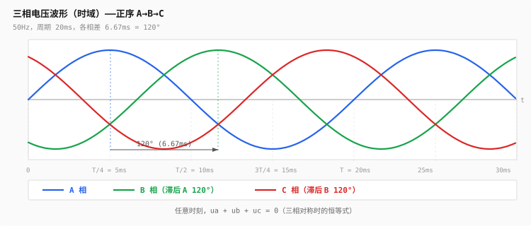
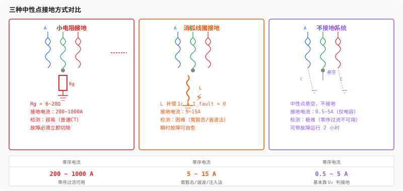

# 第三层：三相交流系统

> 第0层给了你对称分量法的**公式**。这一层告诉你公式算出来的数**在物理世界代表什么**——三个分量从哪里来、长什么样、怎么影响你的 FTU 判断。
>
> 三相是电力系统的骨架。不理解三相，后面的潮流、短路、保护全都没法落地。

---

## 目录

- [3.1 三相电为什么存在](#31-三相电为什么存在)
  - [不是效率，是旋转磁场](#不是效率是旋转磁场)
  - [为什么恰好是三相](#为什么恰好是三相)
- [3.2 三相电压与电流的时空关系](#32-三相电压与电流的时空关系)
  - [时域：三个正弦波差 120°](#时域三个正弦波差-120)
  - [复平面：恒等式 ua+ub+uc=0](#复平面恒等式-uaubuc0)
- [3.3 对称分量法——物理意义](#33-对称分量法物理意义)
  - [正序：系统的正常呼吸](#正序系统的正常呼吸)
  - [负序：不对称的指纹](#负序不对称的指纹)
  - [零序：接地的信号](#零序接地的信号)
  - [一张表说清：什么故障产生什么分量](#一张表说清什么故障产生什么分量)
  - [FTU 实测波形估算分量大小](#ftu-实测波形估算分量大小)
- [3.4 中性点接地方式](#34-中性点接地方式)
  - [三种方式的物理原理](#三种方式的物理原理)
  - [零序电流量级对比](#零序电流量级对比)
  - [对 FTU 零序保护的直接影响](#对-ftu-零序保护的直接影响)
- [3.5 相序与实际应用](#35-相序与实际应用)
  - [正序、负序的旋转方向](#正序负序的旋转方向)
  - [相序接反的现场后果](#相序接反的现场后果)
  - [PT 断线检测——负序的妙用](#pt-断线检测负序的妙用)
- [Feynman 综合检验](#feynman-综合检验)
- [练习题](#练习题)
- [代码化项目](#代码化项目)

---

## 3.1 三相电为什么存在

### 不是效率，是旋转磁场

教材说"三相输电效率高"是对的，但没说到根上。三相电存在的根本原因是：

**只有三相（及以上）系统，能天然产生均匀旋转的磁场。**

单相交流电产生的磁场是**脉振**的——方向不变，大小以 50Hz 来回振荡。就像你用手掌前后推一个轮子，推不转。

```
单相绕组产生的磁场：
  时间 t=0：    ↑ 峰值
  时间 t=5ms：  0（过零）
  时间 t=10ms： ↓ 峰值
  时间 t=15ms： 0（过零）

  磁场方向始终在一条线上，只改变大小和正负 → 脉振磁场
```

单相电动机为什么需要启动电容/启动绕组？因为单相绕组本身产生不了启动转矩——转子停在原地，脉振磁场只是"抖"它，得靠辅助绕组制造一个"假第二相"来打破对称。

**三相绕组**在空间上各差 120° 排列，通入时间上各差 120° 的三相电流：

```
A 相绕组（空间 0°）：    通入 sin(ωt + 0°)   → 磁场 B_A(t)
B 相绕组（空间 120°）：  通入 sin(ωt − 120°) → 磁场 B_B(t)
C 相绕组（空间 240°）：  通入 sin(ωt − 240°) → 磁场 B_C(t)

三个磁场叠加 → 幅值恒定、匀速旋转的合成磁场
转速 = 60f/p = 3000 rpm（一对极，50Hz）
```

这就是阿拉戈圆盘（1824年发现的现象）的数学本质——旋转磁场。

```
时间 →       t=0        t=5ms      t=10ms     t=15ms
           (ωt=0°)    (ωt=90°)   (ωt=180°)  (ωt=270°)

合成磁场方向   → 0°       → 90°      → 180°     → 270°
合成磁场大小   恒定       恒定        恒定        恒定
```

**三相 = 旋转磁场成立 = 发电机成立 = 电动机成立 = 电网成立。** 这是三相电存在的物理根因。

### 为什么恰好是三相

```
相数    导体数    旋转磁场    经济性
 1        2      脉振（不能转）  不行
 2        3~4    旋转但不均匀    不够好（转矩波动大）
 3        3~4    完美均匀        恰好
 4        5      更均匀          边际改进，多一根线
 6        7      更均匀          导线翻倍，几乎无增量收益
```

三是最小整数能让旋转磁场**均匀恒定**。每多加一相，导线增加但磁场均匀度的改善递减。历史上也有六相、十二相输电的实验（用于极高功率整流），但三相是工程最优解。

---

## 3.2 三相电压与电流的时空关系

### 时域：三个正弦波差 120°



50Hz 系统，一个周期 20ms。各相之间差 6.67ms（= 20ms / 3 = 120°/360° × 20ms）。

**三相顺序（A→B→C）：**
- Ua 过正峰值（ωt = 90°）
- 再过 120°（6.67ms 后），Ub 过正峰值
- 再过 120°，Uc 过正峰值

这是**正序 A-B-C**。在示波器上看到的波形就是谁先过峰值。

### 复平面：恒等式 ua+ub+uc=0

把三相电压画在复平面上（时间冻结在 ωt=0 时刻）：

```
               A 相
                ↑
                │ Ua = |U|∠0°
                │
        ────────┼────────
               ╱ ╲
              ╱   ╲
             ╱     ╲
            ╱   ·   ╲      三个相量以 120° 等间隔排列
           ╱         ╲
          ╱           ╲
   Ub = |U|∠-120°    Uc = |U|∠-240° (或 ∠+120°)
```

三相对称时，向量和恒为零：

```
Ua + Ub + Uc = |U|∠0° + |U|∠-120° + |U|∠120°
             = |U|(1∠0° + 1∠-120° + 1∠120°)
             = |U|(1 + (-0.5−j0.866) + (-0.5+j0.866))
             = 0
```

这个恒等式是三相系统无数公式的基础。第2层两瓦特计法的数学证明就用了 ia+ib+ic=0。

**反过来理解：如果三相加起来不为零，说明什么？**

```
Ua + Ub + Uc ≠ 0  →  零序电压存在  →  系统三相不对称或接地
```

FTU 每天都在算这个和——你代码里的 `3U₀ = Ua + Ub + Uc`，就是这个恒等式的"违背量"。

---

## 3.3 对称分量法——物理意义

第0层讲了怎么用矩阵把 Ia/Ib/Ic 变成 I₀/I₁/I₂。现在讲**你分解出来的这三个数到底代表什么物理现象**。

### 正序：系统的正常呼吸

```
正序 I₁ 的特征：
  - 三相幅值相等：|I₁a| = |I₁b| = |I₁c|
  - 三相相位各差 120°，顺序 A→B→C（逆时针）
  - 这是系统正常传输功率的载体
```

**物理直觉：** 正序就是你在正常工况下看到的那个三相系统。发电机发出的是正序，电动机转动靠正序，功率传输走的也是正序。在没有故障的三相对称系统中，负序和零序都是零，**整个系统就只是正序**。

当 FTU 采到 Ia=100A, Ib=100A, Ic=100A，相位各差 120°——这 100A 就全是正序电流。

### 负序：不对称的指纹

```
负序 I₂ 的特征：
  - 三相幅值相等：|I₂a| = |I₂b| = |I₂c|
  - 三相相位各差 120°，但顺序是 A→C→B（顺时针，反转）
  - 系统只要不平衡就出现
```

**物理直觉——为什么要怕负序：**

负序在电动机里产生**反向旋转的磁场**。电机转子正以 3000rpm 跟着正序磁场转，突然叠加了一个以 3000rpm 反向旋转的磁场 → 转子上感应出差频电流（≈100Hz）→ **转子表面急剧发热**、产生制动转矩。

所以对发电机/电动机来说，负序电流是**被严格限制的**——国家标准规定发电机允许的负序电流通常不超过额定电流的 8%~10%，且只能短时承受。

**负序从哪里来：**

| 原因 | 机制 | 负序大小 |
|------|------|---------|
| 三相负荷不平衡 | 某相负载重、某相轻 | 轻~中 |
| 相间短路（不接地） | 两相电流剧增，第三相不变 | 大 |
| 一相断线 | 断线相电流≈0，另两相增大 | 中~大 |
| CT 断线 | 某相采样为零，实际电流正常 | 伪负序（仅采样侧） |
| 线路换位不完全 | 长线路各相对地参数不等 | 小 |

**关键判据——PT 断线 vs 真实故障：**

```
真实的相间故障：既有负序电压（3U₂ ≠ 0），又有负序电流（3I₂ ≠ 0）
PT 一相熔丝断：有负序电压（3U₂ ≠ 0），但电流完全对称 → 3I₂ ≈ 0

→ 有 3U₂ 无 3I₂ = PT 断线，不是真故障
→ 有 3U₂ 有 3I₂ = 真刀真枪的故障
```

这就是第2层 PT 断线判据的物理本源。

### 零序：接地的信号

```
零序 I₀ 的特征：
  - 三相幅值相等：|I₀a| = |I₀b| = |I₀c|
  - 三相相位完全相同（差 0°，不是 120°！）
  - 仅当电流有"地回路"时才出现
```

**物理直觉——为什么零序=接地：**

三相电流 Ia/Ib/Ic 如果加起来不为零，说明有电流"不见了"——它没有通过另外两相流回去，而是流进了大地。`3I₀ = Ia + Ib + Ic` 的本质是测量**地里的漏电流**。

```
正常三线系统：Ia + Ib + Ic = 0（KCL，没有地回路）
                 → 3I₀ = 0

单相接地故障：A 相通过大地回流
                 → Ia + Ib + Ic ≠ 0
                 → 3I₀ ≠ 0（就等于接地故障电流）
```

**零序电流怎么测：**

```
方式一：三相 CT 二次侧并联（Ia + Ib + Ic）
        正常时三者向量和 ≈ 0 → 只流过很小的不平衡电流
        接地故障时 → 零序电流流过 → 零序保护动作

方式二：专用零序 CT（穿心式，三相导线一起穿过）
        正常时 → 三相磁通互相抵消 → 无输出
        接地故障时 → 磁通不抵消 → 输出 3I₀
```

FTU 的零序过流保护就在盯着这个值——3I₀ 超过定值 → 有接地故障。


### 一张表说清：什么故障产生什么分量

```
              正序 I₁     负序 I₂     零序 I₀
              ────────   ────────   ────────
正常三相对称      ✓          0          0
三相短路         ✓          0          0
两相短路         ✓          ✓          0        ← 无地回路
单相接地         ✓          ✓          ✓        ← 有地回路
两相接地         ✓          ✓          ✓        ← 有地回路
单相断线         ✓          ✓          0**      ← 无地回路时无零序
两相断线         ✓          ✓          ✓**
三相不平衡负荷     ✓          ✓          0        ← 中性点不接地系统
```

> **仅在系统中性点接地时，断线才产生零序。不接地系统断线只产生负序。

**这张表是你写保护判断逻辑的基础：**

- 只有负序、没有零序 → 相间故障或不平衡，**不是接地故障**
- 零序出现 → 一定有接地
- 负序零序都出现 → 接地 + 不对称（最常见的情况）
- 只有零序、没有负序 → 理论上可能（三相对称接地），实践中极其罕见

### FTU 实测波形估算分量大小

不跑 FFT，从三相采样幅值的差异就能**估算**正负零序的量级。

**场景一：三相电流高度不对称**

```
Ia = 120A,  Ib = 50A,  Ic = 100A

第一步：算 3I₀  —— 向量和的近似
  如果角度未知，下限 = |Ia+Ib+Ic|/3，上限 = (|Ia|+|Ib|+|Ic|)/3
  粗略估计：平均 ≈ (120+50+100)/3 = 90A
  I₂ + I₀ 大约覆盖了从 90A 到各相的偏差 → I₂ 和 I₀ 量级在 10~30A

第二步：精确算需要相位
  只有三相电流的幅值不能唯一确定分量，
  必须知道至少一个相角差（如 Ia 和 Ib 之间的夹角）。
```

**场景二：一相接地，另两相升高**

```
Ia = 180A,  Ib = 85A,  Ic = 85A

A 相大幅升高→ 接地故障的特征（接地相电流增大）
如果 Ia ≈ Ib+Ic（且系统不接地）→ 可能是 A 相接地
如果 Ia 角度和 Ib+Ic 相关 → 确认接地

粗略估计零序：3I₀ ≈ Ia + Ib + Ic（向量和）
  如果 Ia 相位接近 0°，Ib 和 Ic 接近 -120° 和 +120°（略偏）
  → 3I₀ ≈ Ia 的接地分量部分
```

**FTU 里实际做的事：**

```
// 每周波 DFT 后得到三个相量
I0 = (Ia + Ib + Ic) / 3.0;          // 零序
I1 = (Ia + a*Ib + a*a*Ic) / 3.0;   // 正序
I2 = (Ia + a*a*Ib + a*Ic) / 3.0;   // 负序

// 然后检查：
if (abs(I0) > threshold)  → 接地故障
if (abs(I2) > threshold)  → 不对称故障
if (abs(I0) > th && abs(I2) > th) → 接地 + 不对称
```

---

## 3.4 中性点接地方式

这是配电网的"基因"——你 FTU 部署在哪种中性点接地的线路中，直接决定了零序保护能不能用、定值整多大。

### 三种方式的物理原理



**方式一：小电阻接地**

```
中性点 ── Rg（6Ω ~ 20Ω）── 大地

单相接地时：
  → 故障回路经过 Rg 形成
  → 故障电流 If ≈ U_phase / Rg
  → 10kV 系统：If ≈ 5774V / 10Ω ≈ 577A
  → 电流够大，保护绝对能检测到
  → 但必须立即跳闸（电流大会烧设备）
```

特点：
- 零序电流大（几百到上千安），检测**容易**
- 故障必须立即切除，不能带故障运行
- 对 CT 精度要求不高（5P10 即可）
- 常用于：城市电缆配网（电缆对地电容电流本身就大）

**方式二：消弧线圈接地（谐振接地）**

```
中性点 ── L（可调电感）── 大地

单相接地时：
  → 线路对地电容 C 原本会流过电容电流
  → 消弧线圈 L 提供感性电流 → 与电容电流相位相反
  → 调节 L 使 I_L ≈ I_C → 故障点电流被"补偿"到接近零
  → 电弧自行熄灭（消弧）
```

特点：
- 补偿后接地故障电流非常小（5A ~ 15A），检测**极难**
- 瞬时故障可以自愈（电弧熄灭），不需要跳闸
- 对零序保护要求极高（需暂态法、5次谐波法或主动注入法）
- 常用于：架空线为主的农村配网（雷击闪络→瞬时故障→自愈→不跳闸）

**方式三：不接地系统**

```
中性点 ── 悬空（不接地）

单相接地时：
  → 唯一回路是线路对地分布电容
  → 故障电流 = 系统总对地电容电流（通常 < 5A）
  → 电流极小，不构成短路
  → 可以带故障运行 1~2 小时（规程允许）
```

特点：
- 接地电流极小（< 5A），**最难以检测**
- 可以带故障运行，可靠性高
- 但非接地相电压升高到线电压（√3 倍）→ 绝缘可能被击穿
- 常用于：矿山、早期配网、对供电连续性要求极高的场合

### 零序电流量级对比

```
                小电阻接地      消弧线圈接地      不接地
                ──────────     ────────────    ──────
单相接地电流      200~1000A       5~15A         0.5~5A
零序 CT 要求     普通 5P10      高精度(0.5级)    高精度+小变比
零序保护定值      50~200A       2~5A           0.5~2A
检测难度           容易           困难           极困难
故障自愈           不能           可以            可以
是否必须跳闸        是             否             否
```

### 对 FTU 零序保护的直接影响

**小电阻接地系统 → 常规零序过流即可：**

```
// 整定示例：线路额定电流 300A，接地电流 600A
#define I0_PICKUP  60.0f    // 零序过流启动值，单位 A（一次值）
#define I0_TIME     0.3f    // 延时 0.3s

if (abs(3I0) > I0_PICKUP) {
    start_timer(I0_TIMER, I0_TIME);
    // 定时器到 → 跳闸
}
```

**消弧线圈接地系统 → 传统零序过流基本失效：**

补偿后故障电流可能只有 10A——但负荷不平衡也能产生几安的零序电流。你用 10A 的定值？负荷波动就误动。用 50A？故障时根本达不到。

必须用其他手段：
```
方式一：暂态零序电流法
  捕捉故障发生瞬间的暂态高频分量（几百 Hz~几 kHz）
  暂态分量不被消弧线圈补偿（电感对高频阻抗大）

方式二：5 次谐波法
  消弧线圈只补偿基波（50Hz）
  故障电弧产生的 5 次谐波（250Hz）不被补偿
  → 检测 5 次谐波零序电流

方式三：主动注入法
  从消弧线圈中性点注入特定频率信号
  检测该信号在故障线路中的分布
  → 选线
```

**不接地系统 → 零序过流几乎不可用：**

故障电流 < 5A，正常不平衡电流也可能有 1~2A。定值无处可放。通常靠**零序电压**来判接地（3U₀ 超过定值 → 有接地 → 但不跳闸，只告警 → 人工排查）。

---

## 3.5 相序与实际应用

### 正序、负序的旋转方向

```
正序 A→B→C（逆时针）：
  复平面上，A 相 → B 相 → C 相沿逆时针方向旋转
  
  这是电力系统的"正向"。发电机转动方向、功率正方向都以此为参考。

负序 A→C→B（顺时针）：
  和正序方向相反。
  
  在电动机里产生反向制动力矩。
  在 FTU 方向判据里，负序的相序和正序相反。
```

### 相序接反的现场后果

CT 二次接线时，如果把 B 和 C 相的 S1/S2 对调：

```
正确接法：              错误接法：
  Ia → Ia 不变            Ia → 不变
  Ib → Ib 不变            Ib → 实际接成了 -Ic 的线路
  Ic → Ic 不变            Ic → 实际接成了 -Ib 的线路

后果：
  三相平衡时 → 正常应该 I₂=0，接反后 I₂ 很大
  → FTU 以为系统严重不平衡或发生了故障
  → 方向保护判断依据的电压-电流夹角全部错误
  → 正向故障可能被判为反向 → 拒动
  → 反向故障可能被判为正向 → 误动
```

**投运现场检查相序的方法——测六角图：**

```
带负荷时，测量各相的：
  Ua 和 Ia 的相位角 → 应在负荷功率因数角附近（感性：0°~90°）
  Ub 和 Ib 的相位角 → 同上
  Uc 和 Ic 的相位角 → 同上

如果 B 相的角度明显不对 → CT 二次接线错误
如果三相角度都差 120° 但相对关系正确 → 相序正确
```

### PT 断线检测——负序的妙用

回到第2层最重要的一个判据，这里从物理意义彻底说清楚：

```
判据：有 3U₂（负序电压），但无 3I₂（负序电流） → PT 断线

为什么：
  PT 一相熔丝断 → FTU 读到该相电压≈0
  → 三相电压不对称 → 计算出的 3U₂ ≠ 0
  
  但一次系统正常运行 → 三相电流仍然对称 → 3I₂ ≈ 0
  
  如果是真实的相间故障 → 电压和电流同时不对称 → 3U₂ ≠ 0 且 3I₂ ≠ 0
```

这个判据之所以可靠，是因为它利用了负序分量的**物理出生条件**——负序必须由一次系统的不对称产生。PT 断线只影响测量，不影响一次系统，所以只有电压侧有负序，电流侧没有。

---

## Feynman 综合检验

> "三相电的存在是为了旋转磁场。正序是正常呼吸，负序是不对称的指纹，零序是接地的信号。三相加起来不为零就是零序——电流跑进了大地。中性点接地方式决定了接地电流的大小：小电阻接地像水管破了大洞，消弧线圈接地像有人用手捂住了破洞只漏一点。判断 PT 断线不靠看电压对不对，靠看负序——电压有负序但电流没负序，说明只是一相采样坏了而不是系统真有问题。"

---

## 练习题

**1. 对称分量判断故障类型**

某 10kV 线路 FTU 录到以下 DFT 计算结果：

```
Ua = 5.5∠0° kV,    Ub = 5.8∠-118° kV,   Uc = 5.6∠-242° kV
Ia = 95∠-25° A,    Ib = 180∠-148° A,    Ic = 92∠-265° A
```

(1) 估算 3I₀ 的大致量级。系统中是否有接地故障？
(2) Ib 远大于 Ia/Ic，这是什么故障的特征？
(3) 根据分量表（3.3节），正序/负序/零序各应出现哪些？

**2. 中性点接地方式选型**

(1) 某城区纯电缆配网，线路总长 30km，估算对地电容电流约 60A。应选什么接地方式？为什么？
(2) 某农网 80% 是架空线，雷雨季节跳闸频繁。应选什么接地方式？为什么？
(3) 不接地系统发生单相接地后，规程允许继续运行 1~2 小时。这段时间内非接地相的绝缘承受多大电压？

**3. 相序判断**

某 FTU 投运调试时，测得以下角度（Ua 为参考 0°）：

```
∠(Ua, Ia) = 25°    （A 相电压和 A 相电流的夹角）
∠(Ub, Ib) = 145°   （B 相电压和 B 相电流的夹角）
∠(Uc, Ic) = -95°   （C 相电压和 C 相电流的夹角）
```

已知负荷是感性（电动机），功率因数约 0.85（φ ≈ 32°），三相平衡。

(1) 哪个相的接线可能接反了？
(2) 正确的角度应该在什么范围？

---

## 代码化项目：三相不平衡分析程序

用 Python 或 C 实现对称分量法分解 + 故障类型判据。

```
输入：
  - 三相电压相量：Ua、Ub、Uc（幅值 ∠ 相位，来自 DFT 结果）
  - 三相电流相量：Ia、Ib、Ic
  - 中性点接地方式（小电阻 / 消弧线圈 / 不接地）
  - 各序分量阈值（可配置）

输出：
  - 正序电压 U₁、正序电流 I₁
  - 负序电压 U₂、负序电流 I₂
  - 零序电压 U₀、零序电流 I₀
  - 故障类型判定：
    · 正常（三相对称，仅正序）
    · 接地故障（零序超阈值）
    · 相间故障（负序超阈值，零序正常）
    · PT 断线（负序电压超阈值但负序电流正常）
    · 三相不平衡（负序超阈值但与相间故障的区别）
  - 负序不平衡度：ε₂ = |U₂| / |U₁| × 100%
  - 零序不平衡度：ε₀ = |U₀| / |U₁| × 100%
```

**核心代码框架：**

```
#include <complex.h>
#include <math.h>

// a = e^(j120°) = -0.5 + j0.866
#define a_re  (-0.5)
#define a_im  ( 0.8660254037844386)

typedef struct {
    double re, im;
} complex_t;

// 对称分量变换
void seq_decompose(complex_t Ia, complex_t Ib, complex_t Ic,
                   complex_t *I0, complex_t *I1, complex_t *I2)
{
    // I0 = (Ia + Ib + Ic) / 3
    I0->re = (Ia.re + Ib.re + Ic.re) / 3.0;
    I0->im = (Ia.im + Ib.im + Ic.im) / 3.0;

    // I1 = (Ia + a*Ib + a²*Ic) / 3
    // a*Ib = (-0.5+j0.866)*(Ib.re+jIb.im)
    complex_t a_Ib, a2_Ic;
    a_Ib.re = a_re * Ib.re - a_im * Ib.im;
    a_Ib.im = a_re * Ib.im + a_im * Ib.re;
    // a²*Ic = a* (a*Ic)
    complex_t a_Ic;
    a_Ic.re = a_re * Ic.re - a_im * Ic.im;
    a_Ic.im = a_re * Ic.im + a_im * Ic.re;
    a2_Ic.re = a_re * a_Ic.re - a_im * a_Ic.im;
    a2_Ic.im = a_re * a_Ic.im + a_im * a_Ic.re;

    I1->re = (Ia.re + a_Ib.re + a2_Ic.re) / 3.0;
    I1->im = (Ia.im + a_Ib.im + a2_Ic.im) / 3.0;

    // I2 = (Ia + a²*Ib + a*Ic) / 3
    complex_t a2_Ib;
    a2_Ib.re = a_re * a_Ib.re - a_im * a_Ib.im;
    a2_Ib.im = a_re * a_Ib.im + a_im * a_Ib.re;

    I2->re = (Ia.re + a2_Ib.re + a_Ic.re) / 3.0;
    I2->im = (Ia.im + a2_Ib.im + a_Ic.im) / 3.0;
}

double cabs(complex_t z) {
    return sqrt(z.re * z.re + z.im * z.im);
}

// 故障类型判定
typedef enum {
    FAULT_NONE,           // 正常
    FAULT_GROUND,         // 接地故障
    FAULT_PHASE_TO_PHASE, // 相间故障
    FAULT_PHASE_TO_GROUND,// 两相或单相接地
    FAULT_PT_BROKEN,      // PT 断线
    FAULT_UNBALANCE,      // 负荷不平衡
} FaultType;

FaultType classify_fault(complex_t U0, complex_t U2,
                         complex_t I0, complex_t I2,
                         double th_U2, double th_I2,
                         double th_U0, double th_I0)
{
    double U2_mag = cabs(U2), I2_mag = cabs(I2);
    double U0_mag = cabs(U0), I0_mag = cabs(I0);

    int has_neg_seq_V = (U2_mag > th_U2);
    int has_neg_seq_I = (I2_mag > th_I2);
    int has_zero_seq_V = (U0_mag > th_U0);
    int has_zero_seq_I = (I0_mag > th_I0);

    // PT 断线：有负序电压但无负序电流
    if (has_neg_seq_V && !has_neg_seq_I) return FAULT_PT_BROKEN;

    // 接地故障：有零序
    if (has_zero_seq_I && has_neg_seq_I) return FAULT_PHASE_TO_GROUND;
    if (has_zero_seq_I && !has_neg_seq_I) return FAULT_GROUND;

    // 相间故障：有负序但无零序
    if (has_neg_seq_I && !has_zero_seq_I) return FAULT_PHASE_TO_PHASE;

    // 只有负序电压，极小负序电流 → 可能只是不平衡
    if (has_neg_seq_V && I2_mag < th_I2 * 0.5) return FAULT_UNBALANCE;

    return FAULT_NONE;
}
```

**验收方式：**

1. 生成一组三相对称采样值 → I₀≈0, I₂≈0, I₁≈Ia
2. 手动设置 Ia=200A, Ib=100A, Ic=100A（A 相接地仿真）→ I₀≠0, I₂≠0
3. 手动设置 Ua=0.1pu（PT A 相断线），Ia/Ib/Ic 正常 → 判定为 FAULT_PT_BROKEN
4. 分别用小电阻、消弧线圈、不接地的阈值配置测试 → 对同组数据输出不同的判定结论

---

## 你现在的状态

完成第3层后，你应该能：

1. 说清三相电为什么是三而不是二或四——旋转磁场是根因，效率是副产品
2. 理解 ua+ub+uc=0 这个恒等式在三相系统中的基石地位
3. **用物理语言**解释正序（正常功率传输）、负序（不对称指纹）、零序（接地信号），而不是背矩阵
4. 看一眼故障波形（哪相大、哪相小）就能估算三个分量的大致量级
5. 说清三种中性点接地方式下零序电流的量级差异，以及对你 FTU 零序保护定值的影响
6. 解释 PT 断线检测判据的物理本源——为什么有负序电压无负序电流就是 PT 断线

这一层把第0层的数学赋予了物理生命。正序、负序、零序不再是三个抽象数字——它们分别对应系统的正常呼吸、损伤指纹、接地信号。

完成后，进入第4层——电网结构。那是发输变配用的拓扑世界观。

