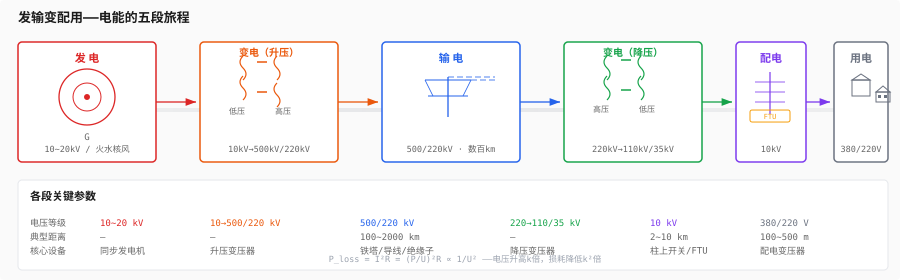
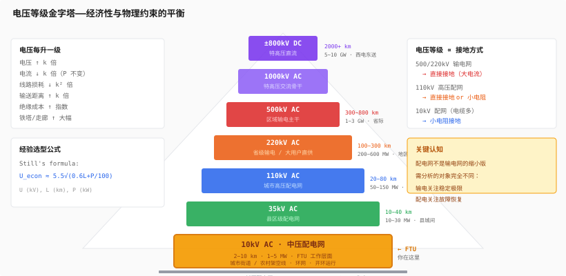
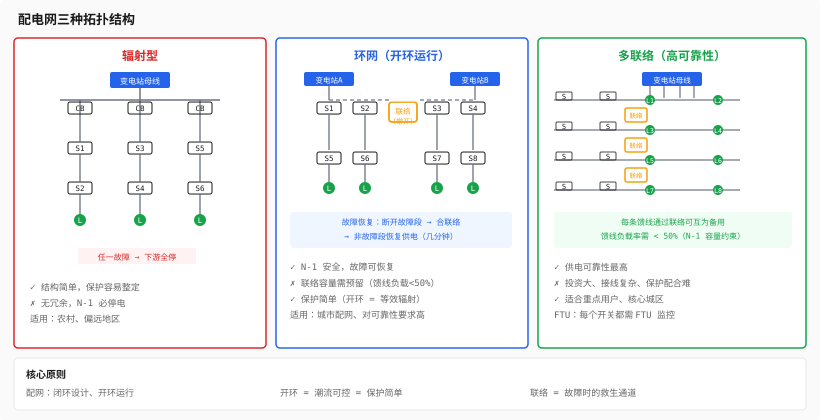

# 第四层：电网结构

> 第3层让你看懂了一条线路上的三相电。这一层带你从"一棵树"走向"整片森林"——电能在空间上如何从发电厂流到你 FTU 安装的那根杆塔。
>
> 电网结构是后面一切分析的地图：潮流在这张图上算，短路在这张图上扩，保护在这张图上配合，FA 在这张图上恢复供电。

---

## 目录

- [4.1 发输变配用——电能的五段旅程](#41-发输变配用电能的五段旅程)
  - [一张图看懂全链条](#一张图看懂全链条)
  - [每一段的角色和约束](#每一段的角色和约束)
  - [为什么要升压又降压——看似浪费的智慧](#为什么要升压又降压看似浪费的智慧)
- [4.2 电压等级分层——经济性+物理的平衡](#42-电压等级分层经济性物理的平衡)
  - [各电压等级的定位](#各电压等级的定位)
  - [为什么是这些数——输送容量与距离的匹配](#为什么是这些数输送容量与距离的匹配)
  - [变压器的角色——等级的铰链](#变压器的角色等级的铰链)
- [4.3 配电网拓扑结构](#43-配电网拓扑结构)
  - [辐射型——最简单也最脆弱](#辐射型最简单也最脆弱)
  - [环网——配网的标配](#环网配网的标配)
  - [联络——馈线之间的救生通道](#联络馈线之间的救生通道)
  - [开环运行——配网最大的设计哲学](#开环运行配网最大的设计哲学)
  - [输电网 vs 配电网：两种完全不同的世界观](#输电网-vs-配电网两种完全不同的世界观)
- [4.4 中性点接地方式与电网结构的关系](#44-中性点接地方式与电网结构的关系)
  - [电缆比例决定接地方式](#电缆比例决定接地方式)
  - [一张表：电网结构 → 接地方式 → FTU 策略](#一张表电网结构--接地方式--ftu-策略)
- [Feynman 综合检验](#feynman-综合检验)
- [练习题](#练习题)
- [代码化项目](#代码化项目)

---

## 4.1 发输变配用——电能的五段旅程



电能从发电机端到你的电表，走完这五个字大约需要几毫秒到几百毫秒不等（取决于距离）。但每一段的物理约束、经济逻辑、保护策略完全不同。

### 每一段的角色和约束

**发电——能量的起点**

- 发电机出口电压通常在 10kV ~ 20kV 范围（受绝缘材料和制造工艺限制，再高会击穿定子绕组绝缘）
- 单机容量从几十 MW（小型火电）到 1750MW（台山核电，世界最大单机之一）
- 发电机直接发出的电压太低，送出 1km 都不划算——必须升压

**变电（升压）——让电能上高速公路**

- 发电机出口 → 升压变压器 → 输电网电压（500kV / 220kV）
- 升压比可达 1:50（10kV → 500kV 是 50 倍）
- 变压器不是"产生能量"，是"换一个电压等级"——功率不变，电流成反比减小

**输电——能量的长距离搬运**

- 500kV / 220kV 是中国的输电骨干网架
- 特点：距离长（数百到数千公里）、功率大（GW 级）、不允许随意停电
- 输电线路像高速公路——封闭、高速、容量大，但一旦断了就是大事故
- 中国特有的"西电东送"：云南/四川的水电经 ±800kV 特高压直流送到广东/华东，距离超过 2000km

**变电（降压）——从高速公路下匝道**

- 输电电压 → 110kV / 35kV（高压配电网）
- 大型变电站（220kV/110kV）是电网的"枢纽站"
- 每降一级电压，供电范围缩小、用户密度增加

**配电——能量的最后一公里**

- 10kV 线路（城市地下电缆或农村架空线）把电能送到小区/村庄
- 配电变压器（10kV/380V）把电压降到用户可用
- 这是你 FTU 工作的层面——10kV 馈线

**用电——能量的终点**

- 380V（三相）进工厂、商业楼宇
- 220V（单相）进家庭
- 负荷种类决定功率因数、谐波、三相平衡度——直接影响配电网的电能质量

### 为什么要升压又降压——看似浪费的智慧

如果不用变压器升降压，发电机 10kV 直接送 100km 到城市：

```
线路电流 I = P / (√3 · U) = 300MW / (√3 · 10kV) ≈ 17320A
线路损耗 P_loss = I²R（假设线路电阻 1Ω）= 17320² × 1 ≈ 300MW
→ 全部电能都损耗在线路上了！
```

同样功率用 500kV 送：

```
I = 300MW / (√3 · 500kV) ≈ 346A
P_loss = 346² × 1 ≈ 0.12MW
→ 损耗只有 0.04%
```

**核心公式：**

```
P_loss = I²R = (P/U)²R ∝ 1/U²

电压升高 k 倍 → 电流降低 k 倍 → 损耗降低 k² 倍
```

这就是升压的根本原因。降压则是因为 500kV 不能直接进家庭——绝缘距离需要好几米，谁家也装不下。

---

## 4.2 电压等级分层——经济性+物理的平衡



### 各电压等级的定位

```
电压等级      角色              输送距离      输送容量        相当于
─────────    ────────────────  ──────────   ──────────     ────────────
±800kV DC    特高压直流远距离    2000+ km     5~10 GW        跨洋货轮
1000kV AC    特高压交流骨干      1000+ km     4~6 GW         洲际高速公路
500kV AC     区域输电主干        300~800 km   1~3 GW         省际高速公路
220kV AC     省级输电/大用户     100~300 km   200~600 MW     国道
110kV AC     城市高压配电网       20~80 km    50~150 MW      城市快速路
35kV AC      县区级配电网         10~40 km    10~30 MW       县道
10kV AC      中压配电网           2~10 km     1~5 MW         城市街道
380V AC      低压配电网           100~500 m   50~200 kW      小区道路
```

### 为什么是这些数——输送容量与距离的匹配

电压等级不是随便定的。每一级都有一个"经济输电距离"——在这个距离内，建设成本 + 运行损耗的总和最小。

```
输电距离 L 的约束：

太短 → 变压器投资不划算（高压设备贵）
太长 → 线路损耗过大（需要更高电压）

每一级电压有一个最优距离窗口：
 10kV:  2 ~ 10 km   （从变电站到小区）
 35kV:  10 ~ 40 km  （县城之间）
110kV:  20 ~ 80 km  （城市各片区）
220kV:  100 ~ 300 km（地区之间）
500kV:  300 ~ 800 km（省际）
```

**决定电压等级选择的三个核心因素：**

1. **输送容量**：P 越大，需要 U 越高（否则电流太大，导线截面不够）
2. **输送距离**：L 越长，需要 U 越高（否则线损吃光所有电能）
3. **绝缘成本**：U 越高，绝缘子、安全距离、铁塔尺寸全都要加大——成本指数增长

**工程上的经验公式（Still's formula，适用于交流输电）：**

```
经济电压 U_econ ≈ 5.5 × √(0.6L + P/100)

其中 U 单位 kV，L 单位 km，P 单位 kW
```

例如：输送 50 MW 距离 50 km → U_econ ≈ 5.5 × √(30 + 500) ≈ 126 kV → 选 110kV。

### 变压器的角色——等级的铰链

电力变压器是各电压等级之间的"铰链"——它只改电压，不改频率，不改功率（忽略自身损耗）。

```
          一次侧                二次侧
    U₁ = 110kV              U₂ = 10kV
    I₁ = 262A               I₂ = 2887A
    ─────────────────────────────────
    S = √3·U₁·I₁ = √3·110k·262 ≈ 50MVA
    S = √3·U₂·I₂ = √3·10k·2887 ≈ 50MVA
    → 功率不变，电压降低 11 倍，电流增加 11 倍
```

**对 FTU 的直接影响：**

你的 FTU 装在 10kV 侧。一次系统的电压等级（110kV/35kV/10kV）决定了：
- CT/PT 的变比选择
- 短路电流的大小（受上级变压器阻抗限制）
- 保护配合的时间级差（从 10kV 出线到 110kV 主变，每级差 0.3~0.5s）

---

## 4.3 配电网拓扑结构

这是你 FTU 安装环境的"空间坐标系"。



### 辐射型——最简单也最脆弱

```
            变电站母线
                │
          ┌─────┴─────┐
          │           │
       开关A1       开关B1
          │           │
       开关A2       开关B2
          │           │
       开关A3       开关B3
          │           │
       负荷A        负荷B
```

**特点：**
- 电能单向流动，从变电站到负荷只有一条路径
- 结构简单，投资少，保护整定容易
- **致命弱点：任何一个元件故障 → 下游全部停电**

**保护策略：**
- 通常采用过流保护 + 重合闸
- 变电站出线断路器为主保护，下游分段开关为后备
- 故障时从变电站侧跳闸，整条线路失电

**适用场景：**
- 农村、偏远地区、对供电可靠性要求不高的场合
- 也是早期配电网的普遍形态

### 环网——配网的标配

```
          变电站母线A              变电站母线B
              │                       │
              ├─────── 联络开关 ───────┤
              │       （常开）          │
        ┌─────┴─────┐           ┌─────┴─────┐
        │           │           │           │
     开关A1       开关B1      开关C1       开关D1
        │           │           │           │
     开关A2       开关B2      开关C2       开关D2
        │           │           │           │
        └───┬───┘               └───┬───┘
        联络开关                   联络开关
        （常开）                    （常开）
```

**环网的核心思想：**
- 正常情况下开环运行（联络开关断开）→ 每条线路独立供电，保护简单
- 任意一段线路故障 → 断开故障段两侧开关 → 合上联络开关 → 非故障段恢复供电

**为什么开环而不是闭环：**
1. 闭环运行时潮流不可控——你不知道电流从 A 变电站绕还是从 B 变电站绕
2. 闭环时继电保护配合极难——故障电流可能来自多个方向
3. 闭环时短路电流更大——多电源并联使等效阻抗减小

**所以配电网选择了"闭环设计、开环运行"的策略——结构有冗余，运行够简单。**

**对 FTU 的意义：**

环网中的 FTU 不只是"测量+保护"，还要参与故障定位和恢复：
```
故障发生 → 变电站出线跳闸 → 全线失电
  → FTU 上报故障指示（过流信号）
  → 主站/就地 FA 判断：故障在哪两个 FTU 之间
  → 断开故障区段两侧开关
  → 合上变电站出线 + 联络开关 → 非故障区段恢复供电
```

### 联络——馈线之间的救生通道

```
         变电站母线
    ┌───────┼───────┐
    │       │       │
  馈线1   馈线2   馈线3
    │       │       │
    ├───┬───┤       │
    │   │   │       │
    │ 联络   │       │
    │ (常开)  │       │
    │       │       │
  负荷1   负荷2   负荷3
```

**联络开关的意义：**
- 正常运行时断开——两条馈线独立运行
- 馈线1 故障 → 断开故障段 → 合上联络 → 馈线2 给馈线1 的非故障段供电

**联络容量约束（N-1 原则）：**
- 馈线2 的容量必须能同时带自己的负荷 + 馈线1 转移过来的负荷
- 这就是配网规划中的"馈线负载率不超过 50%"的来源——为联络留足容量

### 开环运行——配网最大的设计哲学

对比输电和配电的根本差异：

```
输电网：闭环运行
  - 多电源并联，潮流按物理规律自然分配
  - 任一线路断开 → 潮流自动转移到其他线路（前提是不超热稳极限）
  - N-1 原则：失去任一元件，系统仍稳定

配电网：开环运行
  - 单电源辐射供电，潮流方向唯一
  - 线路断开 → 下游全部失电 → 需要人工/自动恢复
  - N-1 通过联络和切换实现（需要时间）
```

**为什么输电网能闭环而配电网不能？**

1. **输电网有发电机的功角稳定性**——闭环的潮流分配是物理决定的，有解
2. **配电网多电源可能导致环流**——不同变电站母线电压相位/幅值有差，合环瞬间会有冲击
3. **配电网保护难以配合**——辐射型保护只考虑单向电流，闭环后方向性保护复杂得多
4. **经济性**——配电网节点太多，全部配置方向保护不现实

### 输电网 vs 配电网：两种完全不同的世界观

```
                输电网                      配电网
                ──────                      ──────
电压等级         220kV ~ 1000kV              10kV ~ 110kV
拓扑结构         网状（多回路互联）             辐射状（开环运行）
运行方式         闭环                          开环
潮流方向         双向（取决于发电和负荷分布）      单向（变电站 → 用户）
停电容忍度       零容忍（大面积停电）             可短时停电（分钟级恢复即可）
故障恢复方式      自动（保护+安稳装置）           半自动（FA 或人工）
节点数量         数百                           数万~数十万
通信依赖         高度依赖（光纤差动、安稳）        中度依赖（FTU 上送数据）
你的 FTU 在哪    不在（输电网用 RTU）             就在这里
```

---

## 4.4 中性点接地方式与电网结构的关系

第3层讲了三种接地方式的原理。这一层告诉你：**在哪种电网结构下选哪种接地方式，不是理论选择，是物理约束。**

### 电缆比例决定接地方式

```
电网结构          电缆比例    对地电容电流    → 应选接地方式
────────────────  ────────    ────────────     ──────────────
城市核心区配网      > 80%      大（>100A）      小电阻接地
城市混合区配网      30%~70%    中（30~100A）    消弧线圈 or 小电阻
农村架空配网        < 20%      小（<30A）       消弧线圈接地 or 不接地
山区/矿区配网       ~0%        极小（<5A）      不接地
```

**物理原因：**

电缆的芯线和金属屏蔽层之间就是一个天然电容器。每公里电缆的对地电容大约是架空线的 30~50 倍：

```
架空线对地电容：  约 0.005 μF/km → Ic ≈ 0.02 A/km（10kV 系统）
电缆对地电容：    约 0.2~0.4 μF/km → Ic ≈ 1~2 A/km（10kV 系统）
```

城市配网电缆长度动不动就 50~100km，总对地电容电流轻松超过 100A。这么大的电容电流：
- 在不接地系统中 → 接地电弧无法自熄 → 必须跳闸 → 失去不接地的优势
- 在消弧线圈系统中 → 需要非常大的补偿容量 → 线圈制造困难、占地大
- 在小电阻接地系统中 → 电容电流叠加在电阻电流上，保护检测到的零序电流更加充裕

**所以：电缆越多 → 电容电流越大 → 越倾向小电阻接地。** 这和"电缆配网保护容易、架空配网保护难"的结论一致。

### 一张表：电网结构 → 接地方式 → FTU 策略

```
电网特征          典型接地方式      零序电流量级    FTU 零序保护       你的关注点
────────────────  ──────────────   ────────────  ────────────────   ──────────────
城市 CBD          小电阻接地        200~600A      常规零序过流        保护容易整定
（纯电缆、环网）                                  50~100A 定值        但故障必须立即切除

城市居民区        消弧线圈 or       30~80A        暂态法/谐波法       保护检测困难
（电缆+架空混合）  小电阻             or 200~400A   取决于接地方式       需要准确选线

县城/农村         消弧线圈接地       5~15A         暂态零序电流法      最难检测
（架空为主）                                      + 5次谐波辅助       瞬时故障可不跳闸

偏远山区          不接地             < 5A          零序电压告警        不跳闸，只告警
（全架空）                                                            靠人工巡线
```

**你在做 FTU 项目时，第一步就应该是搞清楚安装地点的中性点接地方式——** 这直接决定了零序保护方案：
- 如果是小电阻接地 → 愉快的常规零序过流
- 如果是消弧线圈 → 你必须实现暂态捕捉算法
- 如果是不接地 → 零序过流基本没用，改用零序电压判据

---

## Feynman 综合检验

> "电网就像全国的公路系统。发电厂是矿场/油田（能源产地），输电网是高速公路（跨省大通道，不能断），变电站是高速公路出入口（换速度），配电网是城市道路（走到每家每户门口）。电压等级就是道路等级——500kV 是八车道高速，10kV 是双车道街道。配电网开环运行就像城市里每个街区只有一条路进来，路断了就变死胡同——但我们在街区之间留了平时锁着的联络门（联络开关），出了事打开门就能走另一条路。电缆多的地方单相接地电流大，相当于地下水管粗、漏水量大——必须用大漏勺（小电阻接地）快速接住。架空线的地方漏水量小——用消弧线圈慢慢补就行。"

---

## 练习题

**1. 电压等级选择**

某工业园区距 220kV 变电站 30km，总负荷 80MW，功率因数 0.9。

(1) 如果直接用 10kV 送电，线路电流多大？线损率大约多少（假设线路电阻 0.3Ω/km）？
(2) 如果改用 110kV 送电，同样条件下线损率是多少？
(3) 为什么工程上选择 110kV 而非 10kV？除了损耗还有什么考虑？

**2. 拓扑分析与恢复**

```
        变电站（10kV母线）
             │
        ┌────┴────┐
        │         │
       S1        S5
        │         │
       S2        S6
        │         │
    ┌───S3───┐    S7
    │        │    │
  负荷A    S4(常开) │
           │        │
           └───联络──┘
```

S1~S7 为分段开关（常闭），S4 为联络开关（常开）。

(1) 画出正常运行时的供电路径（从变电站到各负荷）。
(2) S2 和 S3 之间发生永久性故障。变电站出线跳闸后，为恢复负荷A 的供电，应该操作哪些开关？
(3) 如果 S4 到联络点之间的线路也有故障，负荷A 还能恢复吗？

**3. 接地方式与电网结构匹配**

(1) 某县城配电网 70% 为架空线，总长 60km。估算对地电容电流，并推荐接地方式。
(2) 同城市中心区，电缆总长 40km。估算对地电容电流，并推荐接地方式。
(3) 上述两个场景中，你的 FTU 零序保护方案应该有什么不同？

---

## 代码化项目：配电网拓扑图表达 + 拓扑着色

用 Python 实现一个配电网拓扑模型，支持故障后的供电区域识别。

```
功能需求：

1. 拓扑建模
   - 节点类型：变电站母线（电源）/ 分段开关 / 联络开关 / 负荷
   - 边类型：线路段
   - 开关状态：闭合 / 断开
   - 用邻接表或邻接矩阵存储

2. 拓扑着色（BFS/DFS）
   - 从电源节点出发，沿闭合开关遍历
   - 标记所有被遍历到的节点为"带电"
   - 没有被遍历到的节点为"失电"
   - 输出：带电区域列表、失电区域列表

3. 故障恢复模拟
   - 输入：某段线路（某条边）故障
   - 自动断开该线路两侧开关
   - 重新拓扑着色 → 找到失电区域
   - 搜索所有联络开关（常开），检查是否连通到另一电源
   - 如果能连通且容量允许 → 合上联络开关 → 重新着色 → 恢复区域标识

4. 输出
   - 故障前：带电节点列表、分区情况
   - 故障后（隔离后）：各区域的带电/失电状态
   - 恢复后：哪些失电节点通过联络恢复了供电
```

**核心数据结构：**

```python
from collections import deque
from dataclasses import dataclass
from typing import List, Dict, Set, Optional
from enum import Enum

class NodeType(Enum):
    SOURCE = 1        # 变电站母线（电源）
    SWITCH = 2        # 分段开关
    TIE_SWITCH = 3    # 联络开关（常开）
    LOAD = 4          # 负荷

class SwitchState(Enum):
    CLOSED = 1
    OPEN = 2

@dataclass
class Node:
    id: str
    node_type: NodeType
    state: SwitchState = SwitchState.CLOSED  # 默闭合
    # 联络开关创建时设为 OPEN

@dataclass
class Edge:
    id: str
    node1: str   # 端点1（节点 id）
    node2: str   # 端点2（节点 id）
    status: str  # "normal" or "faulted"

class DistributionNetwork:
    def __init__(self):
        self.nodes: Dict[str, Node] = {}
        self.edges: Dict[str, Edge] = {}
        self.adj: Dict[str, List[str]] = {}  # 邻接表

    def add_node(self, node: Node):
        self.nodes[node.id] = node
        self.adj[node.id] = []

    def add_edge(self, edge: Edge):
        self.edges[edge.id] = edge
        self.adj[edge.node1].append(edge.node2)
        self.adj[edge.node2].append(edge.node1)

    def topology_color(self) -> tuple:
        """
        BFS 从电源出发拓扑着色。
        返回 (energized_nodes, deenergized_nodes)
        """
        energized: Set[str] = set()
        visited: Set[str] = set()

        # 找所有电源节点作为 BFS 起点
        sources = [nid for nid, n in self.nodes.items()
                   if n.node_type == NodeType.SOURCE]

        for src in sources:
            if src in visited:
                continue
            q = deque([src])
            visited.add(src)
            energized.add(src)
            while q:
                cur = q.popleft()
                for nb in self.adj[cur]:
                    if nb in visited:
                        continue
                    # 只有开关闭合才能遍历过去
                    nb_node = self.nodes[nb]
                    if nb_node.state == SwitchState.OPEN:
                        visited.add(nb)  # 标记访问但不通电
                        continue
                    # 检查边是否故障
                    edge_id = self._find_edge(cur, nb)
                    if edge_id and self.edges[edge_id].status == "faulted":
                        continue
                    visited.add(nb)
                    energized.add(nb)
                    q.append(nb)

        all_nodes = set(self.nodes.keys())
        deenergized = all_nodes - energized
        return energized, deenergized

    def _find_edge(self, n1: str, n2: str) -> Optional[str]:
        for eid, e in self.edges.items():
            if (e.node1 == n1 and e.node2 == n2) or \
               (e.node1 == n2 and e.node2 == n1):
                return eid
        return None

    def isolate_fault(self, edge_id: str):
        """隔离故障：断开故障线路两侧开关"""
        edge = self.edges[edge_id]
        edge.status = "faulted"
        # 断开两侧开关
        for nid in (edge.node1, edge.node2):
            node = self.nodes[nid]
            if node.node_type in (NodeType.SWITCH, NodeType.TIE_SWITCH):
                node.state = SwitchState.OPEN

    def restore_via_tie(self) -> List[str]:
        """
        搜索常开联络开关，尝试恢复失电区域。
        返回：通过联络恢复供电的节点列表。
        """
        _, deenergized = self.topology_color()

        if not deenergized:
            return []

        restored = []
        tie_switches = [nid for nid, n in self.nodes.items()
                        if n.node_type == NodeType.TIE_SWITCH
                        and n.state == SwitchState.OPEN]

        for tie_id in tie_switches:
            # 联络开关一端在带电区，一端在失电区？
            neighbors = self.adj[tie_id]
            energized_side = None
            deenergized_side = None
            for nb in neighbors:
                if nb in deenergized:
                    deenergized_side = nb
                else:
                    # 重新确认是否带电
                    energized_now, _ = self.topology_color()
                    if nb in energized_now:
                        energized_side = nb

            if energized_side is not None and deenergized_side is not None:
                # 合上联络开关
                self.nodes[tie_id].state = SwitchState.CLOSED
                new_energized, _ = self.topology_color()
                newly_restored = new_energized - self._last_energized
                restored.extend(newly_restored)

        return restored
```

**测试用例：**

```
构建一个四馈线的环网结构：

         变电站母线（S0，电源）
    ┌──────┬──────┬──────┐
   S1     S5     S9     S13
    │      │      │      │
   S2     S6     S10    S14
    │      │      │      │
   S3     S7     S11    S15
    │      │      │      │
   S4     S8     S12    S16
    │      │      │      │
   L1     L2     L3     L4（负荷）

联络开关（常开）：
  T1: S4 ↔ S8   （馈线1和馈线2之间的联络）
  T2: S8 ↔ S12  （馈线2和馈线3之间的联络）
  T3: S12 ↔ S16 （馈线3和馈线4之间的联络）

测试场景：
  1. 正常运行 → 所有负荷带电
  2. S2-S3 线路故障 → S2/S3 断开 → L1 失电
     → 合 T1 → L1 由馈线2供电恢复
  3. S2-S3 和 S6-S7 同时故障 → L1 和 L2 失电
     → 合 T1 恢复 L1（由馈线2没故障的上游供电可能不够）
     → 需要更复杂的容量约束判断
```

**验收方式：**

1. 创建一个 4 馈线的环网结构，运行拓扑着色 → 所有节点都应带电
2. 在其中一条馈线上设置一个故障 → 隔离 → 着色 → 输出失电节点列表
3. 触发联络恢复 → 验证失电节点通过联络恢复了供电
4. 验证：如果失电区域没有任何联络连通 → 无法恢复 → 输出告警

---

## 前向引用

本层是整个第二阶段（系统分析）的基础：
- **第 5 层（潮流计算）**：在本层的拓扑模型上，加入线路阻抗参数，计算每个节点的电压和每条线路的功率——这才是真正的"电网状态"。
- **第 5 层（短路分析）**：在本层的拓扑模型上，加入故障阻抗，计算故障电流在电网中的分布——这是第 6 层保护定值整定的依据。
- **第 7 层（FA 馈线自动化）**：本层的拓扑着色和联络恢复，就是 FA 核心算法的原型——故障定位 + 隔离 + 恢复。

---

## 你现在的状态

完成第4层后，你应该能：

1. 看着一张单线图，说出电能从发电机到用户的电压等级变化路径
2. 解释为什么电压分这么多层——不是随意分的，是经济性和物理约束的平衡
3. 说清楚输电和配电的根本差异——闭环 vs 开环、零容忍 vs 可短停
4. 理解配电网三种拓扑（辐射/环网/联络）的优缺点和适用场景
5. 理解电缆比例 → 对地电容电流 → 中性点接地方式 → FTU 零序保护方案这个决策链
6. 用图数据结构表示一个配电网，用 BFS 做拓扑着色，找到带电/失电区域

这一层把前面三层（物理本质、测量系统、三相系统）放进了空间坐标系。你现在不只知道"这条线路的电压电流是多少"，还知道"这条线路在整个电网中的位置"。下一步——第5层——我们开始在这些线上算潮流和短路。

