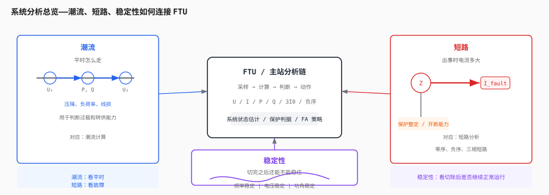
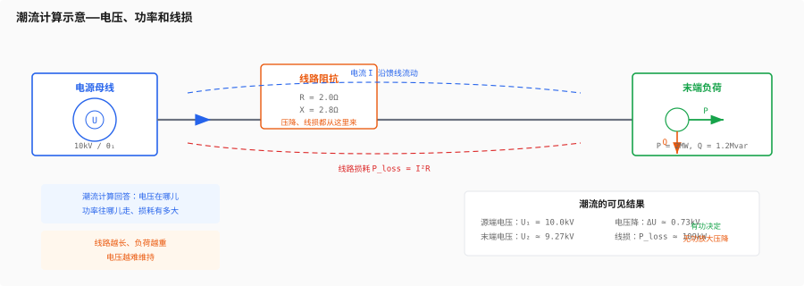
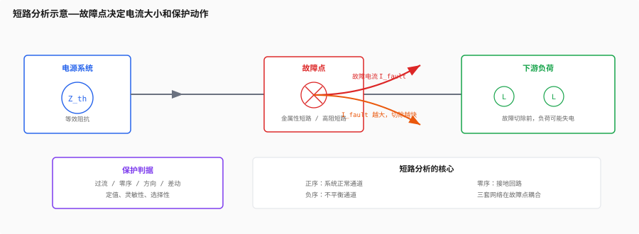
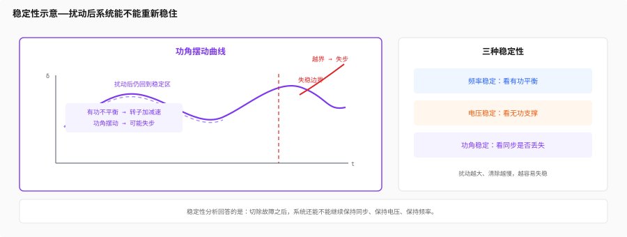

# 第五层：系统分析

> 第4层让你看懂了电网的地图。这一层开始回答更硬核的问题：电网平时怎么分配功率，出事时故障电流有多大，扰动来了以后系统还能不能稳住。
>
> 如果说前四层是在建立“电是什么、怎么测、怎么接、怎么布网”，那这一层就是把这些东西放进一个真正运行的系统里，去算、去比、去判断。



---

## 目录

- [5.1 潮流计算](#51-潮流计算)
  - [潮流到底在算什么](#潮流到底在算什么)
  - [节点和支路：电网的计算对象](#节点和支路电网的计算对象)
  - [为什么功角会影响潮流](#为什么功角会影响潮流)
  - [输电网和配电网的不同算法习惯](#输电网和配电网的不同算法习惯)
- [5.2 短路分析](#52-短路分析)
  - [短路不是“电流大”这么简单](#短路不是电流大这么简单)
  - [三相短路、两相短路、单相接地短路](#三相短路两相短路单相接地短路)
  - [为什么离电源越近短路电流越大](#为什么离电源越近短路电流越大)
  - [短路分析和保护定值的关系](#短路分析和保护定值的关系)
- [5.3 稳定性](#53-稳定性)
  - [频率稳定：有功平衡](#频率稳定有功平衡)
  - [电压稳定：无功平衡](#电压稳定无功平衡)
  - [功角稳定：机组会不会“失步”](#功角稳定机组会不会失步)
  - [系统为什么会连锁崩溃](#系统为什么会连锁崩溃)
- [5.4 系统分析和 FTU 的连接](#54-系统分析和-ftu-的连接)
- [Feynman 综合检验](#feynman-综合检验)
- [练习题](#练习题)
- [代码化项目](#代码化项目)

---

## 5.1 潮流计算



潮流计算不是“算电流有多大”这么窄，它真正要回答的是：

**在某一时刻，整个电网里每个节点的电压是多少，每条线路上有多少有功和无功在流动。**

这件事很像在看一张城市交通图：

- 节点像路口
- 支路像道路
- 有功功率像真正往前运送货物的车流
- 无功功率像维持道路通行能力的辅助资源

你如果只看一个点，很多现象看不出来。只有把整张网放在一起，才能知道：

- 哪条线过载了
- 哪个节点电压偏低了
- 无功是不是不够了
- 潮流会不会从别的通道转过来

### 潮流到底在算什么

最基础的潮流问题，通常是在稳态条件下求解：

- 节点电压幅值 `|U|`
- 节点电压相角 `θ`
- 支路有功 `P`
- 支路无功 `Q`

在数学上，潮流问题本质上是一个非线性方程组：

```text
P_i = f(|U|, θ)
Q_i = g(|U|, θ)
```

你不用一开始就把推导背下来，但你要知道一个事实：

**电网不是“谁想送多少就送多少”，而是由节点电压、相角、阻抗共同决定的。**

这也是为什么同样一条线路，在不同工况下会有完全不同的功率流向。

### 节点和支路：电网的计算对象

做潮流分析时，通常把电网抽象成两类对象：

- 节点：电压发生在这里
- 支路：功率沿着这里流动

常见节点类型有三种：

| 节点类型 | 已知量 | 未知量 | 含义 |
|---|---|---|---|
| 平衡节点 | 电压幅值、相角 | 功率 | 参考点，负责平衡全网功率不匹配 |
| PV 节点 | 有功功率、电压幅值 | 无功、相角 | 常见于发电机母线 |
| PQ 节点 | 有功、无功 | 电压幅值、相角 | 常见于负荷节点 |

这个分类很重要，因为它告诉你：

- 谁在“供”
- 谁在“受”
- 哪些量是系统解出来的，哪些量是外部给定的

**平衡节点的意义尤其关键。**

现实世界里，发电和负荷不会每一秒都完全相等，系统总会有一点误差。这个误差必须由某个节点兜底。潮流计算里，这个兜底角色就是平衡节点。

### 为什么功角会影响潮流

在高压输电网里，最经典的近似关系是：

```text
Pij ≈ (Ui · Uj / Xij) · sin(δij)
```

这里：

- `Ui`、`Uj` 是两端电压幅值
- `Xij` 是线路电抗
- `δij` 是两端相角差

这条公式背后的直觉很简单：

- 相角差越大，功率越想往前推
- 线路电抗越大，功率越难过去
- 电压越高，可传输的功率越大

所以你会看到很多看似“玄学”的现象其实很朴素：

- 两端母线相角差变大，线路潮流就转移
- 某条线断开后，潮流会自动往别的路径绕
- 网架越复杂，潮流分配越不是“人定”的，而是“物理定”的

### 输电网和配电网的不同算法习惯

系统分析不是所有网都用同一套套路。

| 场景 | 典型特征 | 常见算法 |
|---|---|---|
| 输电网 | 高电压、网状结构、X/R 较大 | 牛顿-拉夫逊、快速解耦 |
| 配电网 | 中低压、辐射型或开环运行、R/X 较大 | 前推回代、DistFlow、简化潮流 |

这对你很重要，因为你做的是配电自动化相关工作。

配电网更常见的直觉不是“复杂矩阵”，而是：

- 某条馈线末端电压为什么掉了
- 某个联络开关合上后，另一条线会不会过载
- 一段线路负荷过重时，损耗会怎么变

最常见的配网近似压降公式就是：

```text
ΔU ≈ (R·P + X·Q) / U
```

它直接告诉你：

- 有功会拉低电压
- 无功也会拉低电压
- 线路越长、阻抗越大，电压越难维持

这也是为什么第1层讲“无功支撑电压”，在这一层会变成一个能算出来的结果。

### 一个最小潮流算例

先看一个很小的工程算例，感受潮流不是“拍脑袋估计”。

**场景：**

- 10kV 辐射型馈线
- 线路总长 8km
- 单位阻抗 `R = 0.25Ω/km`，`X = 0.35Ω/km`
- 末端负载 `P = 2MW`，`Q = 1.2Mvar`

先算线路总阻抗：

```text
R_total = 8 × 0.25 = 2.0Ω
X_total = 8 × 0.35 = 2.8Ω
```

负载视在功率：

```text
S = √(P² + Q²) = √(2.0² + 1.2²) ≈ 2.33MVA
```

三相线电流近似为：

```text
I ≈ S / (√3 · U) = 2.33MVA / (√3 · 10kV) ≈ 135A
```

功率因数：

```text
cosφ = P / S ≈ 2.0 / 2.33 ≈ 0.86
sinφ ≈ 0.51
```

用配电线路常见的压降近似估算，单相电压降约为：

```text
ΔU_phase ≈ I · (R_total · cosφ + X_total · sinφ)
         ≈ 135 · (2.0 · 0.86 + 2.8 · 0.51)
         ≈ 424V
```

折算成线电压，大约是：

```text
ΔU_LL ≈ √3 · 424 ≈ 735V
```

也就是说，这条 10kV 线路的末端电压大约掉了 7% 左右。

这个算例说明三件事：

- 末端负荷越大，电压越低
- 无功越大，压降越明显
- 线路越长，潮流计算越不能靠直觉

再看线损：

```text
P_loss ≈ 3 · I² · R_total
       ≈ 3 · 135² · 2
       ≈ 109kW
```

这就是“潮流计算”和“线损分析”其实是一回事的原因。

---

## 5.2 短路分析



短路分析回答的是另一个问题：

**如果系统某一点突然变成低阻甚至近似零阻，电流会冲到多大？**

这件事不是“电流变大一点”，而是可能大到：

- 毁坏设备
- 烧毁母线
- 让断路器开断失败
- 让保护配合失效

所以短路分析是保护定值整定的基础，也是设备选型的基础。

### 短路不是“电流大”这么简单

短路的本质是故障点阻抗骤降。

```text
I_fault ≈ U / Z_th
```

`Z_th` 是从故障点往系统看进去的等效阻抗。

这意味着：

- 电源越强，短路电流越大
- 离变电站越近，短路电流越大
- 系统阻抗越小，故障电流越大

所以同样是 10kV 线路：

- 站内母线附近短路可能很大
- 末端短路会小一些

### 三相短路、两相短路、单相接地短路

常见故障类型可以这样看：

| 故障类型 | 特点 | 计算特点 |
|---|---|---|
| 三相短路 | 最“对称”，但电流通常最大 | 主要看正序网络 |
| 两相短路 | 不对称，无地回路 | 正序 + 负序 |
| 单相接地短路 | 最常见，和接地方式强相关 | 正序 + 负序 + 零序 |

你在第3层已经知道：

- 正序是正常传输功率的通道
- 负序是“不平衡的指纹”
- 零序和接地回路有关

短路分析就是把这三套网络重新接起来，看看故障电流怎么流。

一个很常用的结论是：

```text
三相短路：I3φ ≈ U_phase / Z1
单相接地：I1φ-g ≈ 3U_phase / (Z1 + Z2 + Z0 + 3Zf)
```

这里：

- `Z1` 是正序阻抗
- `Z2` 是负序阻抗
- `Z0` 是零序阻抗
- `Zf` 是故障点阻抗

这条式子直接解释了为什么：

- 中性点接地方式会深刻影响接地短路电流
- 消弧线圈和小电阻接地在保护整定上完全不是一个世界

### 一个最小短路算例

**场景：**

- 10kV 母线
- 正序等值阻抗 `Z1 = j0.8Ω`
- 故障为三相金属性短路

10kV 系统的相电压约为：

```text
U_phase = 10kV / √3 ≈ 5774V
```

三相短路电流近似为：

```text
I3φ ≈ U_phase / |Z1| ≈ 5774 / 0.8 ≈ 7.2kA
```

这说明一件很现实的事：

- 10kV 系统的短路电流可以轻松到几千安
- 保护和开关必须按这个量级去选
- CT、断路器、母线都不能随便挑

如果故障点再串入 `0.5Ω` 过渡电阻，等效阻抗会变大，短路电流会明显下降。

粗略估算：

```text
I ≈ U_phase / √(0.8² + 0.5²) ≈ 5774 / 0.94 ≈ 6.1kA
```

这就解释了为什么高阻故障有时更难被保护看见。

### 短路容量和开断能力

现场经常会听到“短路容量”这个词。它本质上是从母线角度看系统有多“硬”。

```text
S_sc ≈ √3 · U · I_sc
```

如果某 10kV 母线短路电流是 7.2kA，那么短路容量大约是：

```text
S_sc ≈ √3 · 10kV · 7.2kA ≈ 125MVA
```

这个数越大，说明系统越强，故障越凶。

断路器选型时必须保证：

- 额定开断电流大于最大预期短路电流
- 动稳定、热稳定也满足要求
- 保护动作时间和开断能力能配合上

### 为什么离电源越近短路电流越大

故障电流的大小，本质上取决于从故障点看到的总阻抗。

越靠近电源：

- 上游线路阻抗更短
- 变压器阻抗影响更直接
- 故障点“看到”的系统更硬

所以短路电流更大。

这也是为什么配电站出线断路器、母联、主变低压侧开关往往要有更高的开断能力。

你可以把它理解成：

- 电源像一个压力很强的水泵
- 故障点离水泵越近，水压越直接
- 管道一旦破了，喷出来的流量就越大

### 短路分析和保护定值的关系

短路分析不是只给设计院做表格用的，它直接影响现场动作逻辑。

最直接的关系有三个：

1. **保护是否能启动**
   - 故障电流太小，过流保护可能根本看不见

2. **保护是否会误动**
   - 最大负荷电流和最小故障电流太接近，定值就很难整

3. **断路器是否能开断**
   - 如果开断能力小于预期短路电流，设备会很危险

所以短路分析会告诉你：

- 哪些开关必须选更高开断等级
- 哪些保护要加速动作
- 哪些故障需要零序、方向或差动配合

对你这种做 FTU / 保护联动的人来说，这一层就是“定值为什么这么给”的底座。

---

## 5.3 稳定性



稳定性回答的是第三个问题：

**系统受到扰动后，还能不能维持运行平衡。**

这比潮流和短路更“动态”，因为它关心的不是某一瞬间的静态结果，而是“之后会不会继续变坏”。

### 频率稳定：有功平衡

频率是全系统最敏感的状态量之一。

它背后的物理关系很简单：

- 发电有功 = 负荷有功 + 损耗
- 如果发电少了，频率就会往下掉
- 如果发电多了，频率就会往上冲

所以频率稳定本质上是：

**有功功率的瞬时平衡。**

这也是为什么：

- 大机组跳闸会让频率快速下跌
- 低频减载会被自动投入
- 调频资源是系统安全的重要组成

你可以把频率理解成整个电网的“节奏”。

节奏乱了，很多电气设备都会跟着出问题。

### 电压稳定：无功平衡

电压稳定看的不是有功，而是无功。

第1层已经讲过：

- 无功不是没用
- 无功是维持电场和磁场环境的必要条件

当系统无功不足时，会出现：

- 母线电压下降
- 负荷电流上升
- 线路压降更大
- 电压进一步下降

这就是典型的正反馈恶化。

所以电压稳定本质上是：

**无功支撑能力能不能撑住电压。**

常见的支撑手段有：

- 电容器组
- 电抗器
- 有载调压变压器
- SVG / STATCOM

对配电网来说，电压问题常常比频率问题更常见，因为配网离负荷更近，线路压降更敏感。

### 功角稳定：机组会不会“失步”

功角稳定主要出现在发输电系统中。

简单说，发电机转子和系统电磁角度之间必须保持同步。

如果扰动太大：

- 机组转子追不上
- 电磁转矩和机械转矩失衡
- 机组可能失步

你可以把它理解成两个钟摆被绳子连着：

- 平时还能一起摆
- 扰动太大就会越拉越偏
- 最后同步关系断掉

功角稳定问题往往和：

- 大负荷切换
- 短路故障切除时间过长
- 联络线潮流过大
有关。

### 系统为什么会连锁崩溃

电力系统最可怕的不是单点故障，而是故障后的连锁反应。

一个典型链条可能是：

1. 某条线路故障
2. 潮流转移到别的线路
3. 别的线路过载
4. 保护动作切除更多元件
5. 电压进一步下降
6. 频率开始波动
7. 局部失稳扩大成大范围停电

这就是为什么电网强调：

- `N-1` 校验
- 保护配合
- 备用容量
- 负荷转供能力

系统分析的意义，就是在事故真正发生前，先算出它可能怎么坏。

### 三个典型扰动

**扰动 1：少了有功**

- 机组跳闸
- 联络线断开
- 频率下降
- 低频减载可能动作

**扰动 2：少了无功**

- 电容器退出
- 长线路重载
- 电压下降
- 末端用户先出现低电压问题

**扰动 3：通道变少了**

- 一条线路故障退出
- 潮流被迫转移
- 其余线路负担增大
- 如果再超限，就可能继续切除

这三个扰动分别对应：

- 频率问题
- 电压问题
- 过载和连锁问题

你以后看现场事故记录时，基本都能往这三类里归。

---

## 5.4 系统分析和 FTU 的连接

这一层不是纯“调度专业”。

它和你做的 FTU、配电自动化、故障处理其实是直接连着的。

你在现场看到的很多量，最终都要回到这三件事：

- 潮流是否正常
- 短路是否足够大
- 稳定性是否还能撑住

FTU 能做的事情，很多都依赖这层分析：

- 遥测值上传后，主站判断馈线潮流方向
- 故障发生后，主站结合短路范围判断区段
- 联络开关合闸前，要估算转供后是否过载
- 电压异常时，要判断是线路压降还是无功不足

所以对你来说，这一层不是“以后再说”的理论，而是：

**把现场动作解释成系统动作的那把钥匙。**

### FTU 里最该盯的量

如果把系统分析压缩成你 FTU 里真正会用到的几个量，通常就是这些：

| 量 | 代表什么 | 对应系统分析 |
|---|---|---|
| 三相电压 | 母线电压状态 | 潮流 / 电压稳定 |
| 三相电流 | 线路负荷和故障强度 | 潮流 / 短路 |
| 有功功率 | 电能实际传输 | 潮流 / 频率稳定 |
| 无功功率 | 电压支撑能力 | 潮流 / 电压稳定 |
| 3I0 | 接地是否发生 | 短路 / 保护 |
| 负序量 | 不平衡和异常 | 短路 / 稳定性 / PT 断线辅助判断 |

如果你只看单个遥测值，很多问题看不完整。
但如果把这些量组合起来，就能大致还原：

- 当前是正常负荷还是故障
- 电压问题是线路长还是无功不足
- 过载是临时高峰还是故障转供
- 故障是接地、相间还是测量异常

### 一张面向现场的判断表

| 现场现象 | 优先怀疑 | 先看什么 |
|---|---|---|
| 电压整体偏低 | 无功不足或线路过长 | Q、末端电压、线路负荷率 |
| 某相电流突增 | 相间故障或单相接地 | 负序、零序、相间差值 |
| 3I0 突然升高 | 接地故障 | 零序电流、接地方式 |
| 线路跳闸后电流分布改变 | 潮流转移 | 联络开关、转供路径 |
| 频率异常 | 有功失衡 | 大机组/主变状态、负荷切除情况 |

---

## Feynman 综合检验

> “潮流分析是在算平时电怎么走，短路分析是在算出事时电流有多大，稳定性分析是在算系统会不会扛住扰动。潮流决定哪里会超载，短路决定保护和开关能不能切得住，稳定性决定切完之后系统还会不会继续活着。电网不是一根线，而是一张会自己重新分配压力和电流的网。”

如果你能把这段话讲给非专业的人听懂，这一层就已经进门了。

---

## 练习题

**1. 潮流和压降**

一条 10kV 辐射型馈线，线路长度 8km，单位阻抗 `R=0.25Ω/km`，`X=0.35Ω/km`。末端负载为 `P=2MW`，`Q=1.2Mvar`。

(1) 估算末端电流大小。
(2) 用 `ΔU ≈ (R·P + X·Q)/U` 估算电压降。
(3) 如果把无功补偿到 `Q=0.3Mvar`，电压会有什么变化？

**参考思路：**

- 先把负载换成视在功率，再算电流
- 再用 `I²R` 估算线损
- 无功越小，电流越小，压降和线损都会下降

**2. 短路电流**

某 10kV 母线的正序等值阻抗为 `Z1 = j0.8Ω`。

(1) 估算三相短路电流。
(2) 如果故障点再串入 `0.5Ω` 过渡电阻，短路电流会怎样变化？
(3) 为什么距离电源越近的故障更危险？

**参考思路：**

- 三相短路看正序等值阻抗
- 有过渡电阻时，短路电流会被明显削弱
- 越靠近电源，等效阻抗越小，所以电流越大

**3. 稳定性判断**

某区域在傍晚负荷高峰时，有功缺额 30MW、无功缺额 20Mvar。

(1) 先会出现频率问题还是电压问题？
(2) 如果只投电容器而不增加有功支撑，系统最可能改善什么？
(3) 如果主变跳闸，为什么可能会触发低频减载？

**参考思路：**

- 有功缺额会先反映到频率
- 无功缺额会先反映到电压
- 主变跳闸通常会同时影响有功和无功支撑，所以低频和低压问题都可能跟着来

---

## 代码化项目

### 代码化项目：小型电网分析器

用 Python 或 C 实现一个小型电网分析器，至少包含潮流和短路两个核心功能。

```text
输入：
  - 节点列表：平衡节点 / PV 节点 / PQ 节点
  - 支路参数：R、X、变压器变比
  - 节点注入功率：P、Q
  - 故障点位置和故障类型

输出：
  - 各节点电压幅值 / 相角
  - 各支路有功 / 无功 / 电流
  - 线路压降和过载告警
  - 指定故障点的短路电流
  - 断路器开断能力校验
```

**推荐实现顺序：**

1. 先做径向网络的近似压降计算
2. 再做一个 3~5 节点的牛顿-拉夫逊潮流求解
3. 再加入三相短路的 Thevenin 等值计算
4. 最后加上结果报告和告警阈值

**建议你至少先做出的 3 个测试算例：**

1. `2~3` 节点的径向馈线，验证电压是否随负荷增加而下降
2. 10kV 母线三相短路，验证短路电流是否在几千安量级
3. 故障切除后转供，验证联络支路是否会过载

**验收方式：**

- 用手算过的小网络验证节点电压和支路潮流
- 用已知阻抗验证短路电流数量级
- 用不同负荷水平验证电压是否按预期下降

**扩展方向：**

- 增加单相接地短路计算
- 增加简单的 `N-1` 检查
- 增加电压越限和线路过载提示

**如果想继续往下做：**

- 把 PQ 节点和 PV 节点都加进去
- 做一个简单的节点导纳矩阵构建器
- 给结果加 ASCII 单线图输出
- 再把故障前后对比做成报告

---

## 你现在的状态

完成第5层后，你应该能：

1. 说清潮流、短路、稳定性分别在回答什么问题
2. 看懂一张单线图，并判断潮流大概怎么走
3. 估算一个故障点的短路电流数量级
4. 解释为什么电压问题和无功问题总是绑在一起
5. 说明为什么系统分析会直接影响保护、开关和 FA 策略
6. 用一段自己的话讲明白“电网为什么会连锁失稳”

这一层学完后，下一步就进入第6层——继电保护。
那一层会把这里的“算出来”变成“该不该跳、什么时候跳、跳哪一段”。
