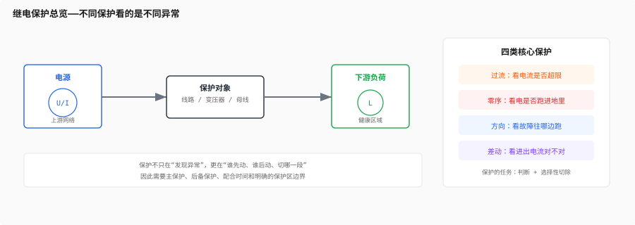
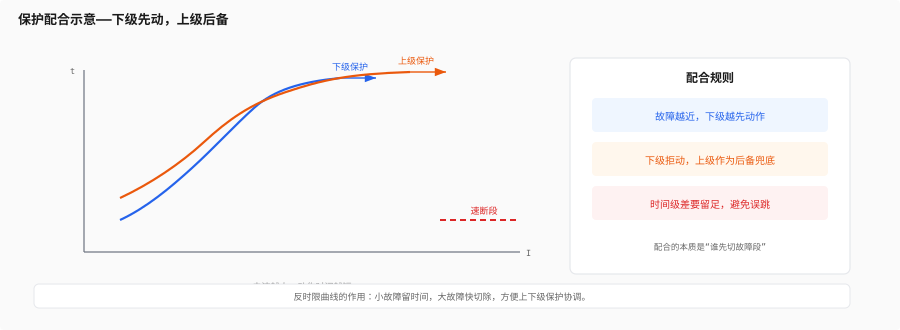

# 第六层：继电保护

> 第5层告诉你电网“会怎么坏”。这一层回答的是：坏了以后，装置凭什么知道、为什么跳、该谁先跳、跳多快。
>
> 如果说第5层是“算”，那么第6层就是“判”。判断一旦错了，后面再高级的 FA、自动化、调度优化都没意义。

---

## 目录

- [6.0 保护的四性](#60-保护的四性)
- [6.1 核心思想](#61-核心思想)
  - [保护区和故障区](#保护区和故障区)
  - [单位保护和非单位保护](#单位保护和非单位保护)
  - [为什么保护要分层配合](#为什么保护要分层配合)
- [6.2 过流保护](#62-过流保护)
  - [过流保护在看什么](#过流保护在看什么)
  - [定值怎么整](#定值怎么整)
  - [反时限为什么有用](#反时限为什么有用)
- [6.3 零序保护](#63-零序保护)
  - [零序从哪里来](#零序从哪里来)
  - [接地方式决定保护能不能用](#接地方式决定保护能不能用)
  - [3I0 和 3U0 各看什么](#3i0-和-3u0-各看什么)
- [6.4 方向保护](#64-方向保护)
  - [为什么只看电流不够](#为什么只看电流不够)
  - [方向判据和 CT/PT 极性](#方向判据和-ctpt-极性)
  - [配网为什么越来越需要方向元件](#配网为什么越来越需要方向元件)
- [6.5 差动保护](#65-差动保护)
  - [KCL 是差动的底层逻辑](#kcl-是差动的底层逻辑)
  - [为什么差动对同步和 CT 一致性敏感](#为什么差动对同步和-ct-一致性敏感)
  - [变压器和母线差动有什么不同](#变压器和母线差动有什么不同)
- [6.6 配电自动化中的保护特点](#66-配电自动化中的保护特点)
- [Feynman 综合检验](#feynman-综合检验)
- [练习题](#练习题)
- [代码化项目](#代码化项目)

---

## 6.0 保护的四性



必须先把这四个词刻在脑子里：

> **选择性 | 速动性 | 灵敏性 | 可靠性**

- 选择性：只切故障区段，不把无辜区域一起切掉
- 速动性：越快越好，设备损伤更小
- 灵敏性：小故障、高阻故障也要尽量能识别
- 可靠性：该动必须动，不该动不能乱动

这四性天然矛盾：

- 速度越快，越容易误动
- 灵敏度越高，越容易受噪声和不平衡影响
- 选择性越强，逻辑越复杂
- 可靠性越高，整定和验证成本越大

所以保护不是“找到一个最大值然后一刀切”，而是在四性之间找平衡。

---

## 6.1 核心思想

### 保护区和故障区

保护的本质是：

**在某个明确的电气范围内，识别异常并快速隔离。**

这个范围就叫保护区。

你可以把电网想成很多圈地：

- 线路保护管线路
- 变压器保护管变压器
- 母线保护管母线
- 发电机保护管发电机

保护区要尽量清晰，因为“边界模糊”就意味着误跳和拒跳都更容易发生。

### 单位保护和非单位保护

从原理上，保护大体分两类：

| 类型 | 依赖什么 | 例子 | 特点 |
|---|---|---|---|
| 单位保护 | 同一保护区内进出量比较 | 差动保护 | 精度高，选择性好 |
| 非单位保护 | 单点电气量是否越限 | 过流、零序、方向 | 结构简单，覆盖面广 |

这条分类很重要，因为它决定了：

- 你是“看本地电气量”
- 还是“看区段两端的差值”

### 为什么保护要分层配合

保护如果只靠一个装置解决所有问题，会很危险。

所以现场一定有“主保护 + 后备保护”的层次：

- 主保护先动作，切最小故障范围
- 后备保护在主保护拒动时兜底
- 上级保护的时间通常要比下级慢一点

这就是保护配合的本质：

**让下级先动，上级后动；让近处先切，远处兜底。**

这也正好对应你在第4层看到的辐射型和开环运行结构。

---

## 6.2 过流保护



### 过流保护在看什么

过流保护最朴素：

**电流超过定值，就认为线路可能出事了。**

它依赖的前提是：

- 故障电流明显大于正常负荷电流
- 保护安装点到故障点之间的阻抗足够小
- 系统拓扑是可以预期的

这就是为什么过流保护特别适合：

- 配电馈线
- 辐射型网络
- 短路电流高于负荷电流很多的场景

### 定值怎么整

过流保护的整定，通常先看两件事：

1. 正常最大负荷电流有多大
2. 最小故障电流有多小

定值必须满足：

- 不在正常负荷和启动电流下误动
- 对最小短路电流仍有足够灵敏度

一个很常见的思路是：

```text
I_pickup > I_load,max
I_pickup < I_fault,min / 灵敏系数
```

但现实里没这么简单，因为还有：

- CT 误差
- 负荷波动
- 电机启动电流
- 合闸涌流
- 线路转供后的潮流变化

### 反时限为什么有用

反时限的意思是：

- 故障越大，动作越快
- 过载越轻，动作越慢

这很符合电网逻辑，因为：

- 轻微过载可以给上一级协调时间
- 严重故障必须立刻切除

反时限曲线的好处是：

- 能照顾短时冲击
- 能和下游设备更好配合
- 能兼顾选择性和速动性

### 一个最小过流算例

假设某条 10kV 馈线：

- 最大负荷电流 `I_load,max = 180A`
- 末端最小故障电流 `I_fault,min = 720A`

如果保护定值取 `I_pickup = 240A`，则：

- 正常最大负荷下不动作
- 故障电流是定值的 3 倍，能可靠启动

这时再配一个反时限时间特性，下游就能先切，上游就留出后备时间。

---

## 6.3 零序保护

### 零序从哪里来

零序保护盯的是：

**三相电流向量和不为零。**

```text
3I0 = Ia + Ib + Ic
```

只要这个和不为零，说明电流有一部分跑进了地回路。

这和第3层的结论完全一致：

- 没有地回路，零序很弱
- 有接地回路，零序就会很明显

### 接地方式决定保护能不能用

零序保护不是“有就能用”，而是要看电网接地方式。

| 接地方式 | 零序电流 | 零序保护适用性 |
|---|---|---|
| 小电阻接地 | 大 | 很适合常规零序过流 |
| 消弧线圈接地 | 小 | 需要暂态法、谐波法等 |
| 不接地 | 很小 | 常规零序过流往往不够用 |

所以你在现场先要知道：

- 这条线的中性点怎么接地
- 零序 CT 是怎么装的
- 零序定值是按什么原则来的

### 3I0 和 3U0 各看什么

`3I0` 和 `3U0` 经常一起出现，但它们不是一回事。

| 量 | 代表什么 | 常见用途 |
|---|---|---|
| 3I0 | 地回路里的电流 | 接地故障检测、零序过流 |
| 3U0 | 中性点偏移引起的零序电压 | 不接地/消弧线圈系统的接地告警 |

一个很实用的经验判断是：

- 有 3I0，通常说明真的有接地电流
- 只有 3U0，不一定有大接地电流，可能只是系统中性点偏移

### 一个最小零序算例

假设某 10kV 系统采用小电阻接地，测得：

- `Ia = 120A`
- `Ib = 115A`
- `Ic = 310A`

那么：

```text
3I0 = Ia + Ib + Ic = 545A
```

这已经很像接地故障而不是普通不平衡了。

如果三相电流都在 100A 左右，但相位对称，`3I0` 仍接近零，那就更像正常负荷。

---

## 6.4 方向保护

### 为什么只看电流不够

只看电流大小，很多场景分不出来：

- 是线路前方故障
- 还是下游故障
- 是外部系统送来的故障电流
- 还是本线路内部故障

所以方向保护要回答的问题是：

**故障电流是往前流，还是往后流？**

这对环网和双电源供电尤其关键。

### 方向判据和 CT/PT 极性

方向保护本质上依赖电压和电流的相位关系。

如果 CT 极性、PT 接线搞错了，方向元件就可能把正向判成反向。

所以方向保护特别敏感于：

- CT 极性
- PT 相序
- 二次接线一致性
- 相量补偿是否正确

你可以把它理解成：

**方向保护不是只看“多大”，而是看“往哪边推”。**

### 配网为什么越来越需要方向元件

过去很多配网是单电源、辐射型，方向保护需求没那么强。

但现在情况变了：

- 环网增多
- 分布式电源增多
- 联络和转供更多
- 故障电流可能双向流动

这就意味着：

- 传统单向过流越来越不够
- 方向元件越来越常见
- 保护定值也要跟着拓扑变化调整

这和你在第5层看到的“潮流转移”是同一件事的保护视角。

### 一个最小方向判断

如果某相电压 `U` 和电流 `I` 的夹角落在正向动作区，且电流超过启动值，那么可以判定正向故障。

如果夹角落在反向区，即便电流很大，也不能直接跳本线的主保护。

这就是方向元件的精髓：

**不是大电流都切，而是本线前方的大电流才切。**

---

## 6.5 差动保护

### KCL 是差动的底层逻辑

差动保护最干净：

**看保护区内流入和流出的电流是否相等。**

也就是基尔霍夫电流定律的工程版：

```text
ΣI_in - ΣI_out = 0  → 正常
ΣI_in - ΣI_out ≠ 0  → 保护区内可能有故障
```

这就是为什么差动保护特别适合：

- 变压器
- 母线
- 发电机
- 线路纵联保护

因为这些对象都能定义出相对清晰的“区内”和“区外”。

### 为什么差动对同步和 CT 一致性敏感

差动保护想要准，必须满足几个前提：

- 两端 CT 变比和极性尽量一致
- 两端采样要同步
- 通信延迟和相位误差要可控

否则，正常负荷也可能被算成差流。

所以差动保护对工程实现的要求很高。

你在 FTU / DTU 开发里会很直观地碰到这些问题：

- 时间同步不稳
- 两端采样偏差
- CT 误差不一致
- 通信异常导致假差流

### 变压器和母线差动有什么不同

| 类型 | 看什么 | 典型难点 |
|---|---|---|
| 母线差动 | 进出总和是否为零 | 动作快，但范围大 |
| 变压器差动 | 一次二次折算后是否平衡 | 变比、接线组别、励磁涌流 |
| 线路差动 | 两端电流是否平衡 | 通信同步、线路建模 |

变压器差动最容易遇到的是励磁涌流问题。

也就是说：

- 变压器刚合闸时，励磁电流可能很大
- 这并不一定是内部故障
- 所以差动逻辑通常要加制动、谐波闭锁或其他判据

### 一个最小差动算例

如果保护区内：

- 进线电流 `100A`
- 出线电流 `98A`

差流只有 `2A`，更像正常误差和负荷波动。

如果进线 `100A`、出线 `20A`，差流达到 `80A`，就要高度怀疑保护区内故障。

差动保护的直觉就是：

**区外故障，进出基本相等；区内故障，差流明显增大。**

---

## 6.6 配电自动化中的保护特点

配电保护和输电保护最大的不同是：

- 配电网更重视经济性和恢复性
- 结构更复杂、分支更多
- 故障里瞬时性故障比例高
- 保护和 FA 是连着的

几个典型特点：

1. 反时限过流仍然是主力
2. 重合闸很常见，因为很多故障是瞬时性的
3. 零序保护强依赖接地方式
4. 联络和转供意味着方向和拓扑信息越来越重要
5. 保护先切，FA 再恢复

这意味着你在 FTU 里写保护逻辑时，不能只考虑“跳不跳”，还要考虑：

- 故障后怎么恢复
- 哪段需要隔离
- 联络开关是否可以合上
- 上下游定值是否协调

### 一条很实用的工程分工

| 环节 | 负责什么 |
|---|---|
| 保护 | 快速切除故障 |
| FA | 隔离故障并恢复供电 |
| 调度/主站 | 协调拓扑和负荷 |

也就是说：

**保护负责“先别烧起来”，FA 负责“尽量别让太多人停电”。**

---

## Feynman 综合检验

> “继电保护就是电网的自动保安系统。过流保护盯的是电流太大，零序保护盯的是电跑到地里了，方向保护盯的是电往哪边跑，差动保护盯的是区段进出电流对不对得上。保护不是只求快，而是要在四性之间平衡：该切的立刻切，不该切的绝不乱切。”

如果你能把这段讲清楚，第 6 层就入门了。

---

## 练习题

**1. 过流整定**

某 10kV 馈线最大负荷电流为 180A，最小故障电流为 720A。

(1) 保护定值为什么不能低于 180A？
(2) 为什么也不能简单取 700A？
(3) 反时限曲线能帮你解决什么问题？

**参考思路：**

- 过低会误动
- 过高会拒动
- 反时限能兼顾选择性和速动性

**2. 零序判断**

某 10kV 系统测得：

- `3I0 = 420A`
- `3U0` 也明显升高

(1) 这更像什么故障？
(2) 如果系统是消弧线圈接地，为什么常规零序过流有时不够用？
(3) 为什么要先知道接地方式再谈保护定值？

**参考思路：**

- 3I0 高通常是接地
- 消弧线圈会补偿基波接地电流
- 接地方式决定保护原理

**3. 方向与差动**

某条联络线在故障时出现双向潮流。

(1) 只用过流保护会有什么问题？
(2) 为什么方向元件可以改善选择性？
(3) 差动保护为什么对同步和 CT 一致性要求高？

**参考思路：**

- 双向潮流下单纯看电流大小不够
- 方向元件能区分前后向故障
- 差动依赖进出量一致性

---

## 代码化项目

### 代码化项目：保护逻辑引擎

用 Python 或 C 实现一个小型保护逻辑引擎，至少支持：

```text
输入：
  - 三相电压、电流相量
  - 3I0、3U0
  - CT/PT 极性和变比
  - 接地方式
  - 定值表（过流、零序、方向、差动）

输出：
  - 过流启动 / 跳闸
  - 零序启动 / 跳闸
  - 正向 / 反向判定
  - 差流 / 制动比
  - 动作记录和动作原因
```

**推荐实现顺序：**

1. 先做过流启动和跳闸
2. 再加零序判断
3. 再加方向元件
4. 最后加差动和制动逻辑

**建议先做的测试场景：**

1. 正常负荷，不应动作
2. 单相接地，应触发零序保护
3. 线路前向故障，应触发方向过流
4. 区外故障，差动不应误动
5. CT 极性接反，方向判据应出现异常

**更像现场的测试数据：**

```text
场景 A：正常运行
  Ua = 5.77∠0° kV,   Ub = 5.77∠-120° kV,  Uc = 5.77∠120° kV
  Ia = 92∠-28° A,    Ib = 90∠-148° A,     Ic = 91∠92° A
  3I0 ≈ 1.8A,        3U0 ≈ 0.6V
  预期：不过流、不零序、不跳闸

场景 B：A 相单相接地
  Ua = 1.2∠-4° kV,   Ub = 6.1∠-118° kV,   Uc = 6.0∠118° kV
  Ia = 420∠-10° A,   Ib = 85∠-146° A,     Ic = 78∠104° A
  3I0 ≈ 360A,        3U0 明显抬升
  预期：零序启动，若为小电阻接地则应跳闸

场景 C：线路前向两相短路
  Ua = 5.2∠0° kV,    Ub = 4.6∠-132° kV,   Uc = 5.1∠128° kV
  Ia = 310∠-18° A,   Ib = 295∠-165° A,    Ic = 44∠88° A
  3I0 ≈ 8A,          负序明显增大
  预期：过流启动，方向元件判正向，零序不一定启动

场景 D：区外故障导致反向电流
  Ua = 5.8∠0° kV,    Ub = 5.7∠-121° kV,   Uc = 5.8∠119° kV
  Ia = 260∠160° A,   Ib = 252∠-78° A,     Ic = 248∠41° A
  预期：电流大但方向判反向，主保护不应直接跳闸

场景 E：CT 极性接反
  Ua 与 Ia 的相位关系与正常场景相反
  预期：方向判据异常，运行记录中应输出“极性/相序可疑”
```

**扩展方向：**

- 加入反时限曲线
- 加入重合闸逻辑
- 加入动作时间统计
- 加入 FA 关联输出

**核心代码框架：**

下面这份骨架更接近真实工程写法。你可以先把相量计算部分替换成自己现有的 DFT/RMS 模块，再把判据一条条接进去。

```python
from dataclasses import dataclass
from enum import Enum
import cmath


class GroundingType(Enum):
    SOLID = "solid"
    RESISTANCE = "resistance"
    ARC_SUPPRESSION = "arc_suppression"
    UNGROUNDED = "ungrounded"


@dataclass
class ProtectionSetting:
    overcurrent_pickup: float
    zero_sequence_pickup: float
    directional_angle_deg: float
    differential_bias_ratio: float


@dataclass
class PhasePhasors:
    ua: complex
    ub: complex
    uc: complex
    ia: complex
    ib: complex
    ic: complex
    u0: complex
    i0: complex


@dataclass
class ProtectionDecision:
    overcurrent_start: bool = False
    zero_sequence_start: bool = False
    directional_forward: bool = False
    differential_trip: bool = False
    reason: str = ""


def magnitude(z: complex) -> float:
    return abs(z)


def phase_deg(z: complex) -> float:
    return cmath.phase(z) * 180.0 / 3.141592653589793


def calc_zero_sequence(ia: complex, ib: complex, ic: complex) -> complex:
    return (ia + ib + ic) / 3.0


def overcurrent_check(ph: PhasePhasors, setting: ProtectionSetting) -> bool:
    ia = magnitude(ph.ia)
    ib = magnitude(ph.ib)
    ic = magnitude(ph.ic)
    return max(ia, ib, ic) >= setting.overcurrent_pickup


def zero_sequence_check(ph: PhasePhasors, setting: ProtectionSetting, grounding: GroundingType) -> bool:
    # 不接地/消弧线圈接地时，常规零序过流往往要更谨慎
    i0_mag = magnitude(ph.i0)
    if grounding in (GroundingType.ARC_SUPPRESSION, GroundingType.UNGROUNDED):
        return i0_mag >= setting.zero_sequence_pickup * 0.5
    return i0_mag >= setting.zero_sequence_pickup


def directional_check(u: complex, i: complex, setting: ProtectionSetting) -> bool:
    # 判断电压电流夹角是否落在正向区
    angle = (phase_deg(u) - phase_deg(i) + 360.0) % 360.0
    return angle < setting.directional_angle_deg or angle > (360.0 - setting.directional_angle_deg)


def differential_check(i_in: complex, i_out: complex, setting: ProtectionSetting) -> bool:
    operate = abs(i_in - i_out)
    restraint = (abs(i_in) + abs(i_out)) / 2.0
    if restraint <= 1e-6:
        return False
    return operate / restraint >= setting.differential_bias_ratio


def evaluate_protection(ph: PhasePhasors, setting: ProtectionSetting, grounding: GroundingType) -> ProtectionDecision:
    decision = ProtectionDecision()
    decision.overcurrent_start = overcurrent_check(ph, setting)
    decision.zero_sequence_start = zero_sequence_check(ph, setting, grounding)
    decision.directional_forward = directional_check(ph.ua, ph.ia, setting)

    # 示例：把 A 相当作区段一侧进线，B 相当作出线
    decision.differential_trip = differential_check(ph.ia, ph.ib, setting)

    if decision.differential_trip:
        decision.reason = "differential"
    elif decision.zero_sequence_start:
        decision.reason = "zero_sequence"
    elif decision.overcurrent_start and decision.directional_forward:
        decision.reason = "forward_overcurrent"
    elif decision.overcurrent_start:
        decision.reason = "overcurrent"
    else:
        decision.reason = "normal"

    return decision
```

**这段代码可以继续往下扩的地方：**

- 把 `directional_check` 改成三相各自独立判断
- 把 `differential_check` 改成真实的区段两端电流比较
- 加入反时限计时器，做动作延时
- 加入重合闸状态机，处理瞬时故障

**最小测试驱动示例：**

```python
setting = ProtectionSetting(
    overcurrent_pickup=240.0,
    zero_sequence_pickup=60.0,
    directional_angle_deg=45.0,
    differential_bias_ratio=0.30,
)

ph = PhasePhasors(
    ua=complex(5770, 0),
    ub=complex(-2885, -5000),
    uc=complex(-2885, 5000),
    ia=complex(290, -95),
    ib=complex(-235, -132),
    ic=complex(-40, 40),
    u0=complex(0.6, 0.1),
    i0=complex(120, 15),
)

decision = evaluate_protection(ph, setting, GroundingType.RESISTANCE)
print(decision.reason)
```

这段驱动代码至少应该能帮助你验证：

- 正常场景不动作
- 故障场景能分出过流、零序和方向
- 差动逻辑不会因为区外波动就误动

---

## 你现在的状态

完成第 6 层后，你应该能：

1. 说清保护的四性分别是什么
2. 分清过流、零序、方向、差动各自盯什么
3. 解释为什么接地方式会决定零序保护方案
4. 说明 CT/PT 极性为什么会影响方向元件
5. 解释差动保护为什么是“进出电流比较”
6. 说出为什么保护和 FA 是前后衔接而不是互相替代

这一层学完后，下一步就进入第 7 层——配电自动化。
你会看到保护不是终点，而是 FA 恢复供电的起点。
