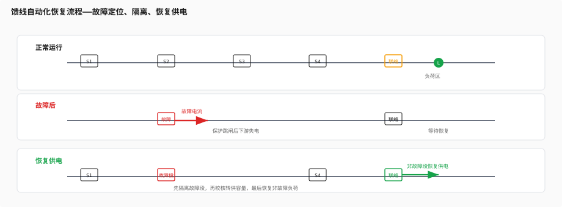
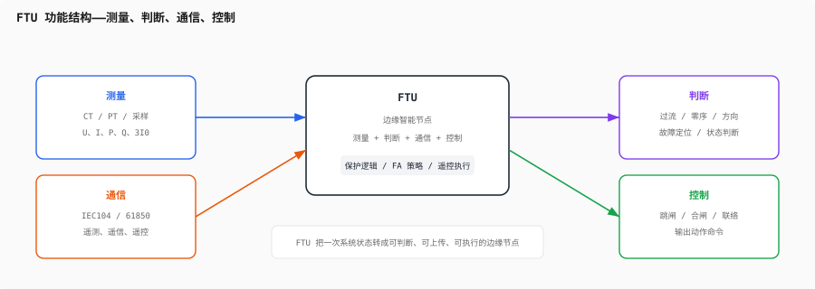
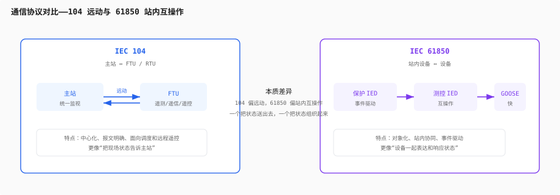

# 第七层：配电自动化

> 前 6 层解决的是“电网怎么运行、怎么坏、怎么判、怎么切”。这一层解决的是：切完以后，怎么把非故障区段尽快恢复，把人停电的时间压到最短。
>
> 你会在这里第一次真正把“保护、通信、拓扑、遥测、遥信、遥控”连成一个闭环。

---

## 目录

- [7.1 FA（馈线自动化）](#71-fa馈线自动化)
  - [FA 到底在做什么](#fa-到底在做什么)
  - [故障定位、隔离、恢复供电](#故障定位隔离恢复供电)
  - [就地型、主站型、半分布型](#就地型主站型半分布型)
- [7.2 FTU 到底是什么](#72-ftu-到底是什么)
  - [FTU 的四个核心功能](#ftu-的四个核心功能)
  - [FTU 为什么不是简单采集器](#ftu-为什么不是简单采集器)
  - [FTU 和第 2/4/6 层的关系](#ftu-和第-24-6-层的关系)
- [7.3 三遥](#73-三遥)
- [7.4 IEC104 / 61850](#74-iec104--61850)
  - [104 和 61850 的本质差异](#104-和-61850-的本质差异)
  - [协议不是“搬数据”](#协议不是搬数据)
- [7.5 FA 的典型流程](#75-fa-的典型流程)
- [Feynman 综合检验](#feynman-综合检验)
- [练习题](#练习题)
- [代码化项目](#代码化项目)

---

## 7.1 FA（馈线自动化）



FA 的本质就三个字：

**定位、隔离、恢复。**

它解决的不是“故障有没有”，而是：

- 故障在哪一段
- 怎么把故障段切掉
- 怎么让非故障段先活回来

这和第 6 层保护的关系非常明确：

- 保护负责第一时间切除故障
- FA 负责在切除之后恢复供电

### FA 到底在做什么

FA 不是单一功能，而是一组策略的组合。

典型流程是：

1. 某段线路故障
2. 上级保护动作，馈线跳闸
3. FTU 上送故障信息、开关状态、馈线电流电压
4. 主站或就地逻辑判断故障区段
5. 打开故障区段两侧开关
6. 合上联络开关，把非故障区段转供出去

所以 FA 的核心不是“自动重合一次”，而是：

**自动做出一个最小停电范围的拓扑重构。**

### 故障定位、隔离、恢复供电

这三步要分开理解：

| 步骤 | 目标 | 依赖 |
|---|---|---|
| 定位 | 找到故障段 | FTU 遥信、故障指示、方向信息 |
| 隔离 | 切除故障区段 | 开关遥控、保护动作 |
| 恢复供电 | 把非故障区段送电 | 联络开关、负荷校核、拓扑判断 |

如果只会隔离，不会恢复，那还是“停电管理”。

只有把恢复做起来，才叫 FA。

### 就地型、主站型、半分布型

配电自动化一般有三种实现方式：

| 类型 | 核心特点 | 优点 | 缺点 |
|---|---|---|---|
| 就地型（智能分布式） | FTU 之间直接协同 | 快、主站依赖小 | 算法和站间通信要求高 |
| 主站型 | 主站统一判断和下发遥控 | 逻辑集中，便于运维 | 通信和主站依赖强 |
| 半分布型 | 就地判断 + 主站协调 | 灵活，适配复杂场景 | 设计和联调最麻烦 |

对工程来说，选哪一种，不是“谁更高级”，而是看：

- 网络结构复杂不复杂
- 通信稳定不稳定
- 可靠性要求高不高
- 运维团队能不能接住

---

## 7.2 FTU 到底是什么



FTU 本质上不是一个“采集箱”，而是一个：

**测量 + 判断 + 通信 + 控制** 的边缘智能节点。

### FTU 的四个核心功能

| 功能 | 作用 | 对应知识层 |
|---|---|---|
| 测量 | 采三相电压电流、零序、状态量 | 第 2 层 |
| 判断 | 过流、零序、方向、故障逻辑 | 第 6 层 |
| 通信 | 上送遥测遥信、接收遥控 | 第 7 层 |
| 控制 | 跳闸、合闸、联络切换 | 第 4/6/7 层 |

这意味着 FTU 不是单独存在的，它是一个把前面知识全部串起来的节点。

### FTU 为什么不是简单采集器

因为 FTU 不是只负责“看见”。

它还要“判断”和“行动”。

比如：

- 看见过流，不一定跳闸，要看是否达到定值、是否有方向
- 看见 3I0，不一定就是本段故障，要看接地方式和上下游关系
- 看见电压异常，不一定是故障，也可能是转供后负荷变化

所以 FTU 的价值在于：

**把一次系统的现场状态，转成可以被自动化系统理解和使用的事件。**

### FTU 和第 2/4/6 层的关系

| 依赖层 | 依赖什么 | 在 FTU 里体现为什么 |
|---|---|---|
| 第 2 层 | CT/PT、采样、误差链 | 遥测值准不准 |
| 第 4 层 | 电网结构、拓扑、联络关系 | 知道自己在哪一段 |
| 第 6 层 | 保护逻辑、定值、四性 | 知道该不该跳 |

所以 FTU 不是孤立开发的，而是：

**采样、拓扑、保护、通信、控制的交汇点。**

---

## 7.3 三遥

三遥是 FTU 和主站之间最基础的交互：

| 类型 | 传什么 | 本质 |
|---|---|---|
| 遥测 | 电压、电流、有功、无功、频率等模拟量 | 反映“现在是什么状态” |
| 遥信 | 开关分合位、告警、保护动作等状态量 | 反映“发生了什么事件” |
| 遥控 | 跳闸、合闸、切换命令 | 反映“要做什么动作” |

你在写 104 规约代码时，本质上就是在处理这三类信息。

### 遥测、遥信、遥控之间的关系

- 遥测告诉你系统有没有偏离正常
- 遥信告诉你设备状态有没有变
- 遥控让你把动作送回现场

这三者合起来，才形成闭环。

如果只上传遥测，不上传遥信，那你可能知道“电流变大了”，但不知道“哪个开关已经跳了”。
如果没有遥控，你只能看不能改。

---

## 7.4 IEC104 / 61850



这时你会第一次真正理解：

**规约不是搬数据，而是在定义电网状态怎么被描述、怎么被交换、怎么被响应。**

### 104 和 61850 的本质差异

| 协议 | 场景 | 特点 |
|---|---|---|
| IEC104 | 主站与 RTU/FTU | 远动、遥测遥信遥控 |
| IEC61850 | 变电站/站内设备 | 面向对象、互操作、事件驱动 |

简单说：

- 104 更像“把现场告诉主站”
- 61850 更像“设备之间协同表达状态”

### 协议不是“搬数据”

如果把协议理解成“把 A 机器的数据搬到 B 机器”，那就太浅了。

更准确地说，协议定义的是：

- 什么数据该传
- 什么时候传
- 用什么语义传
- 出错时怎么办

这和电网运行强绑定，因为电网不是静态文件系统，而是一个不断变化的实时系统。

---

## 7.5 FA 的典型流程

把上面的内容串起来，一个典型 FA 流程是这样的：

1. 线路某处故障
2. 上级保护动作，馈线失电
3. FTU 上送遥信和故障信息
4. 主站或就地逻辑判断故障区段
5. 打开故障段两侧开关
6. 校核联络馈线负载能力
7. 合上联络开关，恢复非故障区段

这里最关键的工程判断有三个：

- 故障区段有没有被真正隔离
- 联络转供后会不会过载
- 转供后电压是否还能满足要求

所以 FA 不是“合闸动作”这么简单，而是：

**一个带约束条件的拓扑恢复问题。**

---

## Feynman 综合检验

> “配电自动化就像城市交通管理系统：保护先把事故车道封住，FTU 把路况和封路状态传回来，FA 再决定怎么改道、怎么恢复通行。三遥就是路况、事故和调度指令，104 和 61850 就是这些信息在系统里的语言。FA 的目标不是证明发生了故障，而是尽快让没出事的路先恢复通车。”

如果你能把这段话讲清楚，第 7 层就已经站住了。

---

## 练习题

**1. FA 流程判断**

某 10kV 馈线故障后，变电站出线跳闸。已知：

- A 段开关 S1 到 S2 之间故障
- S2 后方还有一段健康负荷
- 相邻馈线有联络开关可转供

(1) FA 的目标是什么？
(2) 先做什么，后做什么？
(3) 为什么不能直接合上联络开关？

**参考思路：**

- 先隔离故障段
- 再校核转供容量和电压
- 最后恢复非故障区段

**2. 三遥判断**

某 FTU 上送以下信息：

- 遥测：三相电压下降
- 遥信：分段开关跳位
- 遥控：主站下发合闸命令

(1) 这三类信息分别在 FA 中起什么作用？
(2) 如果遥信丢失，主站会遇到什么问题？
(3) 如果遥控执行失败，系统应该怎样处理？

**参考思路：**

- 遥测看状态，遥信看事件，遥控做动作
- 遥信丢失会影响拓扑判断
- 遥控失败要重试或降级处理

**3. 通信协议理解**

(1) 为什么 104 更像“远动”，61850 更像“站内协同”？
(2) 如果协议理解成“搬数据”，会忽略什么关键问题？
(3) FTU 开发里，为什么协议和保护逻辑要一起考虑？

**参考思路：**

- 协议定义的是状态交换和响应语义
- 只看搬运会忽略时序、语义和异常处理
- 保护动作和通信状态是互相影响的

---

## 代码化项目

### 代码化项目：FA 拓扑恢复模拟器

用 Python 或 C 实现一个简单的 FA 模拟器，至少包含：

```text
输入：
  - 配电网拓扑
  - 开关状态（分段、联络）
  - 负荷大小
  - 故障位置
  - 转供容量约束

输出：
  - 故障前带电区域
  - 故障隔离后的失电区域
  - 转供后恢复供电的区域
  - 联络开关是否可合
  - 是否出现过载或低电压
```

**推荐实现顺序：**

1. 先做拓扑建模
2. 再做带电区域搜索
3. 再做故障隔离
4. 再做联络转供判定
5. 最后加负荷和电压约束

**建议先做的测试场景：**

1. 辐射型馈线故障，验证下游是否失电
2. 环网开环运行，验证联络转供是否恢复
3. 联络馈线负载过高，验证是否禁止合闸

**更像现场的测试数据：**

```text
场景 A：辐射型馈线 S2 上游故障
  拓扑：电源 - S1 - S2 - S3 - S4 - 负荷段
  故障：S2 与 S3 之间永久性接地故障
  预期：
    - S1 跳闸后全线失电
    - 故障段两侧开关断开
    - 非故障下游若无联络则仍失电

场景 B：环网转供恢复
  拓扑：馈线 A 负荷 180kW，馈线 B 负荷 160kW，联络开关常开
  故障：馈线 A 的中段故障已被隔离
  联络能力：馈线 B 剩余裕度 220kW
  预期：
    - 联络开关可合
    - 馈线 A 非故障区段恢复供电
    - 馈线 B 不超载

场景 C：联络过载禁止合闸
  馈线 B 当前负荷 460kW
  故障转供后需再带入 120kW
  联络容量上限 550kW
  预期：
    - 转供后总负荷 580kW 超限
    - FA 拒绝合闸
    - 主站建议分段削负荷或改由其他联络转供

场景 D：遥信丢失
  分段开关实际跳位，但遥信未回传
  预期：
    - 主站无法准确确认拓扑
    - FA 降级为保守策略
    - 需要二次确认或人工介入
```

**扩展方向：**

- 加入主站/就地两种逻辑
- 加入重合闸流程
- 加入遥测异常和遥信异常处理
- 加入 IEC104 报文模拟

**核心代码框架：**

下面这份骨架适合先做成一个最小可用的 FA 原型。思路是：

- 先把拓扑建成图
- 再从电源出发做带电区域搜索
- 然后隔离故障段
- 最后尝试联络转供

```python
from dataclasses import dataclass, field
from collections import deque
from enum import Enum


class SwitchState(Enum):
    CLOSED = "closed"
    OPEN = "open"


class NodeType(Enum):
    SOURCE = "source"
    SWITCH = "switch"
    LOAD = "load"
    TIE = "tie"


@dataclass
class Node:
    name: str
    node_type: NodeType
    load_kw: float = 0.0
    energized: bool = False


@dataclass
class Edge:
    u: str
    v: str
    switch_name: str
    state: SwitchState = SwitchState.CLOSED
    is_tie: bool = False


@dataclass
class FeederGraph:
    nodes: dict[str, Node] = field(default_factory=dict)
    edges: list[Edge] = field(default_factory=list)

    def neighbors(self, name: str):
        for e in self.edges:
            if e.state != SwitchState.CLOSED:
                continue
            if e.u == name:
                yield e.v, e
            elif e.v == name:
                yield e.u, e


def build_adjacency(graph: FeederGraph) -> dict[str, list[str]]:
    adj = {name: [] for name in graph.nodes}
    for e in graph.edges:
        if e.state != SwitchState.CLOSED:
            continue
        adj[e.u].append(e.v)
        adj[e.v].append(e.u)
    return adj


def mark_energized(graph: FeederGraph, source_names: list[str]) -> set[str]:
    for node in graph.nodes.values():
        node.energized = False

    q = deque(source_names)
    visited = set(source_names)

    while q:
        cur = q.popleft()
        graph.nodes[cur].energized = True
        for nxt, _edge in graph.neighbors(cur):
            if nxt not in visited:
                visited.add(nxt)
                q.append(nxt)

    return visited


def isolate_fault(graph: FeederGraph, fault_switches: list[str]) -> None:
    for e in graph.edges:
        if e.switch_name in fault_switches:
            e.state = SwitchState.OPEN


def can_transfer(graph: FeederGraph, tie_name: str, capacity_limit_kw: float) -> bool:
    # 简化判断：联络支路闭合后，统计非故障区域负荷是否超限
    total_load = sum(n.load_kw for n in graph.nodes.values() if not n.energized and n.node_type == NodeType.LOAD)
    return total_load <= capacity_limit_kw


def try_restore(graph: FeederGraph, tie_name: str, capacity_limit_kw: float) -> bool:
    tie_edge = next((e for e in graph.edges if e.switch_name == tie_name), None)
    if tie_edge is None:
        return False

    if tie_edge.state != SwitchState.OPEN:
        return False

    if not can_transfer(graph, tie_name, capacity_limit_kw):
        return False

    tie_edge.state = SwitchState.CLOSED
    return True
```

**这段代码下一步可以继续补的地方：**

- 给每个节点增加电压等级和负荷曲线
- 在 `try_restore` 前增加潮流/容量校核
- 把 `isolate_fault` 改成“断故障段两侧开关”
- 把 `mark_energized` 的结果输出成带电/失电清单
- 增加主站型与就地型两套恢复策略

**最小测试驱动示例：**

```python
graph = FeederGraph(
    nodes={
        "S": Node("S", NodeType.SOURCE),
        "S1": Node("S1", NodeType.SWITCH),
        "S2": Node("S2", NodeType.SWITCH),
        "L1": Node("L1", NodeType.LOAD, load_kw=120),
        "L2": Node("L2", NodeType.LOAD, load_kw=180),
        "T": Node("T", NodeType.TIE),
    },
    edges=[
        Edge("S", "S1", "CB1"),
        Edge("S1", "S2", "CB2"),
        Edge("S2", "L1", "CB3"),
        Edge("S2", "L2", "CB4"),
        Edge("L1", "T", "TIE1", state=SwitchState.OPEN, is_tie=True),
    ],
)

mark_energized(graph, ["S"])
isolate_fault(graph, ["CB2"])
mark_energized(graph, ["S"])
restored = try_restore(graph, "TIE1", capacity_limit_kw=400)
print(restored)
```

这段驱动代码至少应该能帮助你验证：

- 故障前后带电区域是否变化正确
- 故障段是否真的被隔离
- 联络转供是否受容量约束
- 恢复逻辑是否会在不满足条件时拒绝合闸

---

## 你现在的状态

完成第 7 层后，你应该能：

1. 说清 FA 的目标是“定位、隔离、恢复”
2. 解释 FTU 为什么不是单纯采集器
3. 分清遥测、遥信、遥控各自的作用
4. 说清 104 和 61850 的本质差异
5. 用拓扑恢复的思路解释配电自动化流程
6. 从保护、通信、拓扑三个角度看懂一次故障恢复

这一层学完后，你基本就把前面 0 到 6 层串成闭环了。
后面如果继续深入，就是把这些逻辑进一步产品化、工程化、平台化。
